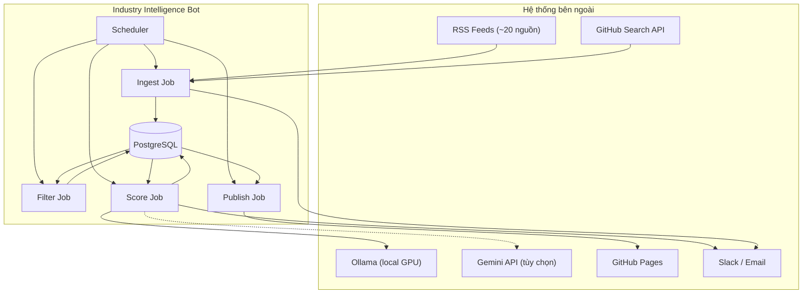
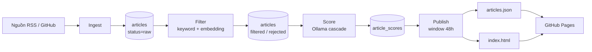
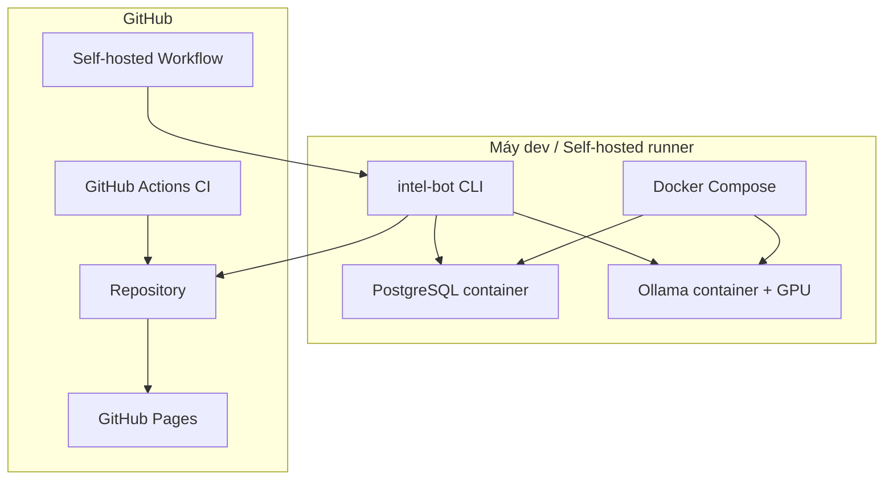
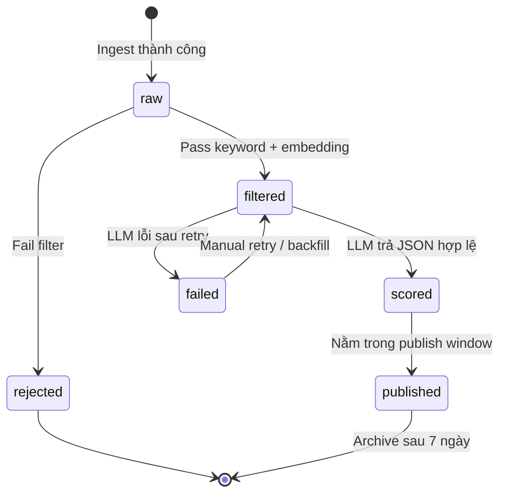
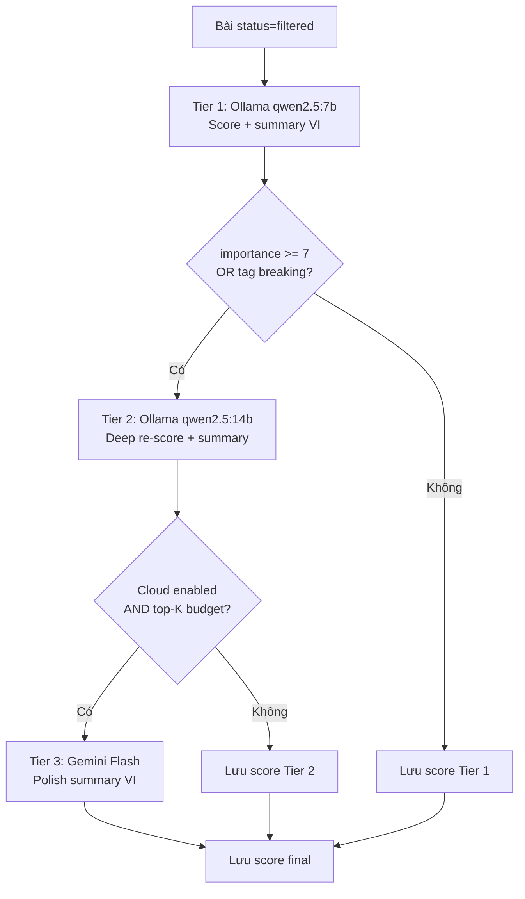
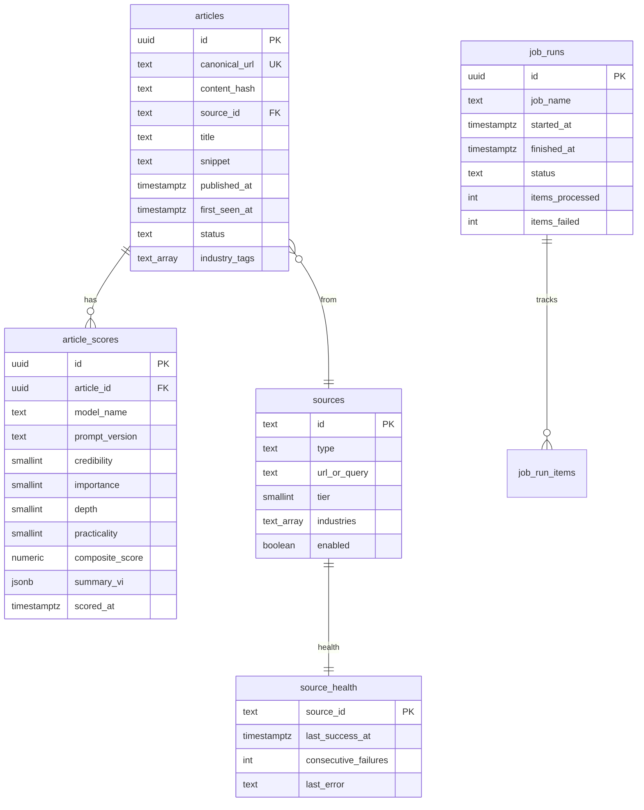

# Industry Intelligence Bot — Production Plan

> **Phiên bản tài liệu:** 1.0  
> **Ngày tạo:** 2026-07-07  
> **Mục đích:** Kế hoạch chi tiết để xây dựng bot thu thập, lọc, phân tích và xuất bản tin tức ngành (AI, Construction, HVAC, Manufacturing) theo chuẩn môi trường production.

---

## Mục lục

1. [Tổng quan dự án](#1-tổng-quan-dự-án)
2. [Mục tiêu & phạm vi](#2-mục-tiêu--phạm-vi)
3. [Nguyên tắc thiết kế production](#3-nguyên-tắc-thiết-kế-production)
4. [Kiến trúc hệ thống](#4-kiến-trúc-hệ-thống)
5. [Cấu trúc repository](#5-cấu-trúc-repository)
6. [Mô hình dữ liệu](#6-mô-hình-dữ-liệu)
7. [Pipeline & Job specification](#7-pipeline--job-specification)
8. [Thiết kế lớp Ingest](#8-thiết-kế-lớp-ingest)
9. [Thiết kế lớp Filter](#9-thiết-kế-lớp-filter)
10. [Thiết kế lớp Score (LLM)](#10-thiết-kế-lớp-score-llm)
11. [Thiết kế lớp Publish](#11-thiết-kế-lớp-publish)
12. [Cấu hình (Config-as-Code)](#12-cấu-hình-config-as-code)
13. [Hạ tầng & triển khai](#13-hạ-tầng--triển-khai)
14. [CI/CD & Scheduler](#14-cicd--scheduler)
15. [Observability & vận hành](#15-observability--vận-hành)
16. [Bảo mật & tuân thủ](#16-bảo-mật--tuân-thủ)
17. [Chiến lược kiểm thử](#17-chiến-lược-kiểm-thử)
18. [Đánh giá chất lượng (Eval loop)](#18-đánh-giá-chất-lượng-eval-loop)
19. [Quản lý chi phí](#19-quản-lý-chi-phí)
20. [Roadmap triển khai theo phase](#20-roadmap-triển-khai-theo-phase)
21. [Checklist tổng hợp](#21-checklist-tổng-hợp)
22. [Phụ lục](#22-phụ-lục)

---

## 1. Tổng quan dự án

### 1.1 Mô tả

Industry Intelligence Bot là hệ thống tự động hóa pipeline tin tức chuyên ngành, hoạt động theo lịch hàng ngày:

| Bước | Mô tả ngắn |
|------|------------|
| **Thu thập** | Đọc ~20 nguồn RSS (VentureBeat, MIT Tech Review, Construction Dive, ACHR News, …) và repo GitHub theo chủ đề ngành |
| **Lọc sơ bộ** | Loại bài không liên quan (keyword + embedding) để tiết kiệm tài nguyên LLM |
| **Phân tích AI** | Chấm điểm đa tiêu chí, tóm tắt 5 điểm bằng tiếng Việt — ưu tiên Ollama local, tùy chọn cloud cho bài quan trọng |
| **Tích lũy 48h** | Gộp bài hôm nay + hôm qua, không mất bài khi quét lại |
| **Xuất bản** | Trang HTML trên GitHub Pages, sắp xếp theo ngành và điểm quan trọng |

### 1.2 Đối tượng sử dụng

- **Giai đoạn 1:** Cá nhân — digest intel hàng sáng trước khi làm việc
- **Giai đoạn 2 (tùy chọn):** Nhóm nhỏ — chia sẻ link GitHub Pages hoặc email digest

### 1.3 Khác biệt so với script đơn giản

| Script đơn giản | Production (mục tiêu dự án) |
|-----------------|----------------------------|
| Chạy 1 file Python, ghi HTML | 4 job độc lập có state machine |
| Không lưu lịch sử | Database persistent, migration versioned |
| Chạy lại = duplicate | Idempotent — chạy lại an toàn |
| Lỗi im lặng | Log structured + alert + job_runs audit |
| Config hardcode | Config YAML externalized |
| Không test | Unit + integration + eval set |

---

## 2. Mục tiêu & phạm vi

### 2.1 Mục tiêu (Goals)

| ID | Mục tiêu | Chỉ số thành công |
|----|----------|-------------------|
| G1 | Tự động thu thập tin ngành mỗi ngày không cần can thiệp tay | Chạy liên tục ≥ 7 ngày, 0 manual fix |
| G2 | Giảm nhiễu — chỉ surface bài thực sự liên quan | Precision@20 ≥ 70% trên eval set |
| G3 | Tóm tắt tiếng Việt có giá trị đọc nhanh | User review: ≥ 4/5 bài top-10 “đáng đọc” |
| G4 | Chi phí gần zero (Ollama local) | ≤ $5/tháng nếu dùng hybrid cloud |
| G5 | Vận hành giống production — debug được khi lỗi | Mọi job có audit trail trong DB |

### 2.2 Phạm vi trong (In Scope)

- Thu thập RSS và GitHub Search API (theo topic, không global trending)
- Lọc hybrid: keyword + embedding similarity
- Scoring LLM qua Ollama (cascade 7B → 14B), tùy chọn Gemini Flash cho top-K
- Lưu trữ PostgreSQL (hoặc SQLite giai đoạn dev)
- Publish static site GitHub Pages
- Self-hosted runner cho pipeline có Ollama
- Alert Slack/email khi job fail
- Eval set 100 bài để đo chất lượng filter/score

### 2.3 Phạm vi ngoài (Out of Scope — giai đoạn đầu)

- Scrape full-text paywall
- Mobile app native
- Multi-tenant auth / user accounts
- Real-time streaming (< 5 phút latency)
- Phân tích sentiment thị trường chứng khoán
- Tự động đăng lại nội dung (copyright risk)

---

## 3. Nguyên tắc thiết kế production

### 3.1 Bảy nguyên tắc bắt buộc

| # | Nguyên tắc | Áp dụng cụ thể |
|---|------------|----------------|
| P1 | **Idempotency** | `canonical_url` unique; score theo `prompt_version`; publish không ghi đè score cũ |
| P2 | **Single source of truth** | Bảng `articles` + `article_scores`; HTML/JSON chỉ là view derived |
| P3 | **Fail gracefully** | 1 RSS source down → job status `partial`, các source khác tiếp tục |
| P4 | **Separation of concerns** | ingest / filter / score / publish là CLI command riêng, có thể rerun độc lập |
| P5 | **Config externalized** | RSS list, rubric, model routing — sửa config không sửa code |
| P6 | **Observability by default** | Mọi job ghi `job_runs`; LLM call log latency + model + prompt_version |
| P7 | **Reproducibility** | Pin dependency; lưu prompt_version; migration DB versioned |

### 3.2 Quy ước đặt tên

| Loại | Quy ước | Ví dụ |
|------|---------|-------|
| Job name | snake_case | `ingest`, `filter`, `score`, `publish` |
| Source ID | `{publisher}_{topic}` | `venturebeat_ai`, `construction_dive` |
| Article status | lowercase enum | `raw`, `filtered`, `rejected`, `scored`, `failed`, `published` |
| Prompt version | semantic versioning | `score_v1.0.0`, `score_v1.1.0` |
| Config file | snake_case.yaml | `sources.yaml`, `models.yaml` |

---

## 4. Kiến trúc hệ thống

### 4.1 Sơ đồ kiến trúc tổng thể (C4 — Level 1)



### 4.2 Sơ đồ luồng dữ liệu (Data Flow)



### 4.3 Sơ đồ triển khai vật lý (Deployment)



### 4.4 State machine — vòng đời bài viết



### 4.5 Thiết kế cascade LLM



### 4.6 Ranh giới module (Bounded Context)

| Module | Trách nhiệm | Không được làm |
|--------|-------------|----------------|
| `ingest` | Fetch, normalize, dedup, insert raw | Gọi LLM, render HTML |
| `filter` | Keyword + embedding, set status | Gọi LLM scoring |
| `score` | LLM call, validate output, insert scores | Fetch RSS, render HTML |
| `publish` | Query window 48h, export JSON/HTML | Thay đổi score logic |
| `config` | Load & validate YAML | Business logic |
| `observability` | Log, metrics, job_runs | Domain logic |

---

## 5. Cấu trúc repository

### 5.1 Cây thư mục đầy đủ

```
industry-intel-bot/
├── .github/
│   ├── workflows/
│   │   ├── ci.yml                    # Lint, test, migration check
│   │   ├── pipeline.yml              # Self-hosted: ingest→filter→score→publish
│   │   └── deploy-pages.yml          # Deploy GitHub Pages khi docs/ thay đổi
│   └── dependabot.yml
│
├── alembic/                          # Database migrations
│   ├── versions/
│   └── env.py
│
├── config/                           # Config-as-Code (commit vào git)
│   ├── sources.yaml                  # RSS + GitHub sources
│   ├── keywords.yaml                 # Keyword groups theo ngành
│   ├── interest_profile.txt          # Anchor text cho embedding filter
│   ├── rubric.yaml                   # Định nghĩa tiêu chí chấm 1-10
│   ├── models.yaml                   # Ollama/cloud routing
│   ├── source_tiers.yaml             # Điểm uy tín nguồn theo domain
│   └── app.yaml                      # Window 48h, budget cap, timezone
│
├── docker/
│   ├── Dockerfile                    # Image cho app CLI
│   └── docker-compose.yml            # postgres + ollama + app (dev/prod-like)
│
├── docs/
│   ├── PRODUCTION_PLAN.md            # Tài liệu này
│   ├── ARCHITECTURE.md               # Kiến trúc rút gọn cho onboard
│   ├── RUNBOOK.md                    # Hướng dẫn xử lý sự cố
│   └── ADR/                          # Architecture Decision Records
│       ├── 001-postgresql-over-sqlite.md
│       ├── 002-ollama-primary-llm.md
│       └── 003-self-hosted-runner.md
│
├── prompts/                          # Prompt templates versioned
│   ├── score_v1.0.0.txt
│   └── score_v1.1.0.txt
│
├── scripts/
│   ├── bootstrap.sh                  # Setup lần đầu: pull ollama models, migrate DB
│   ├── seed_sources.py               # Validate sources.yaml, test connectivity
│   └── healthcheck.sh                # doctor: DB + Ollama + disk
│
├── src/
│   └── intel_bot/
│       ├── cli.py                    # Entrypoint Typer: ingest|filter|score|publish|doctor|eval
│       ├── config.py                 # Pydantic Settings load từ env + yaml
│       ├── db/
│       │   ├── models.py             # SQLAlchemy models
│       │   ├── session.py            # Session factory
│       │   └── repositories.py       # CRUD theo domain
│       ├── ingest/
│       │   ├── rss_fetcher.py
│       │   ├── github_fetcher.py
│       │   ├── normalizer.py         # URL canonical, title normalize
│       │   └── deduplicator.py
│       ├── filter/
│       │   ├── keyword_filter.py
│       │   └── embedding_filter.py
│       ├── score/
│       │   ├── llm_client.py         # Abstract + Ollama + Gemini impl
│       │   ├── prompt_builder.py
│       │   ├── output_schema.py      # Pydantic validation
│       │   ├── cascade_router.py
│       │   └── credibility_merger.py # Rule-based + LLM blend
│       ├── publish/
│       │   ├── json_exporter.py
│       │   ├── html_renderer.py
│       │   └── git_publisher.py      # Commit + push artifact
│       ├── observability/
│       │   ├── logging.py            # structlog JSON
│       │   └── metrics.py
│       └── jobs/
│           ├── ingest_job.py
│           ├── filter_job.py
│           ├── score_job.py
│           └── publish_job.py
│
├── templates/
│   ├── index.html.j2                 # Trang chính
│   ├── partials/
│   │   ├── article_card.html.j2
│   │   └── industry_section.html.j2
│   └── assets/
│       └── style.css
│
├── tests/
│   ├── unit/
│   ├── integration/
│   ├── fixtures/                     # Sample RSS XML, LLM JSON responses
│   └── eval/                         # Labeled dataset cho precision test
│
├── data/                             # Runtime data (gitignore trừ public output)
│   └── public/                       # Output commit lên git cho Pages
│       ├── articles.json
│       └── archive/                  # Bài > 7 ngày
│
├── docs-site/                        # GitHub Pages root (generated)
│   └── index.html
│
├── pyproject.toml
├── .env.example
├── .gitignore
└── README.md
```

### 5.2 Tài liệu bắt buộc cần viết

| File | Nội dung | Khi nào viết |
|------|----------|--------------|
| `README.md` | Quick start, prerequisites, lệnh CLI | Phase 0 |
| `ARCHITECTURE.md` | Diagram + module overview | Phase 0 |
| `RUNBOOK.md` | Troubleshooting từng loại lỗi | Phase 1 |
| `ADR/*.md` | Quyết định kiến trúc và lý do | Mỗi quyết định lớn |
| `.env.example` | Liệt kê biến môi trường, không giá trị thật | Phase 0 |

---

## 6. Mô hình dữ liệu

### 6.1 Entity Relationship (mô tả quan hệ)



### 6.2 Bảng `articles` — chi tiết cột

| Cột | Kiểu | Mô tả | Ghi chú |
|-----|------|-------|---------|
| `id` | UUID | Primary key | Generate khi insert |
| `canonical_url` | TEXT, UNIQUE | URL đã chuẩn hóa | Dedup chính |
| `content_hash` | TEXT | Hash của normalized title + domain | Dedup cross-source |
| `source_id` | TEXT | FK → sources | |
| `source_type` | TEXT | `rss` hoặc `github` | |
| `title` | TEXT | Tiêu đề gốc | |
| `snippet` | TEXT | Mô tả ngắn từ RSS | Input chính cho LLM |
| `full_text` | TEXT, nullable | Full text nếu fetch được | Phase 2+, nguồn cho phép |
| `published_at` | TIMESTAMPTZ | Thời điểm bài đăng gốc | Từ RSS |
| `first_seen_at` | TIMESTAMPTZ | Lần đầu bot phát hiện | Dùng cho recency boost |
| `status` | TEXT | State machine | Xem mục 4.4 |
| `industry_tags` | TEXT[] | Tags ngành | Từ filter + LLM |
| `rejection_reason` | TEXT, nullable | Lý do reject | `keyword_miss`, `embedding_low` |
| `created_at` | TIMESTAMPTZ | | |
| `updated_at` | TIMESTAMPTZ | | Auto update |

**Index cần tạo:**
- `canonical_url` (unique)
- `content_hash`
- `status, first_seen_at` (composite — query publish window)
- `source_id, published_at`

### 6.3 Bảng `article_scores` — chi tiết cột

| Cột | Kiểu | Mô tả |
|-----|------|-------|
| `id` | UUID | PK |
| `article_id` | UUID | FK articles |
| `model_name` | TEXT | VD: `qwen2.5:7b`, `gemini-2.0-flash` |
| `prompt_version` | TEXT | VD: `score_v1.0.0` |
| `tier` | TEXT | `fast`, `deep`, `cloud` |
| `credibility` | SMALLINT | 1–10 |
| `importance` | SMALLINT | 1–10 |
| `depth` | SMALLINT | 1–10 |
| `practicality` | SMALLINT | 1–10 |
| `composite_score` | NUMERIC(4,2) | Weighted average |
| `summary_vi` | JSONB | Mảng 5 bullet tiếng Việt |
| `why_it_matters_vi` | TEXT | 1 câu tóm tắt impact |
| `confidence` | TEXT | `high`, `medium`, `low` |
| `raw_response` | JSONB | Raw LLM output để debug |
| `latency_ms` | INT | Thời gian inference |
| `scored_at` | TIMESTAMPTZ | |

**Quy tắc:** Không UPDATE score cũ — mỗi lần re-score với prompt_version mới = INSERT mới. Publish job luôn lấy score mới nhất theo `scored_at`.

### 6.4 Bảng `job_runs` — audit trail

| Cột | Mô tả |
|-----|-------|
| `job_name` | `ingest`, `filter`, `score`, `publish` |
| `status` | `success`, `partial`, `failed` |
| `items_processed` | Số item xử lý |
| `items_failed` | Số item lỗi |
| `error_summary` | Message tóm tắt nếu fail |
| `metadata` | JSONB: duration, config snapshot, version |

### 6.5 Bảng `source_health` — theo dõi nguồn

| Cột | Mô tả |
|-----|-------|
| `source_id` | PK |
| `last_success_at` | Lần fetch thành công cuối |
| `last_error_at` | Lần lỗi cuối |
| `consecutive_failures` | Đếm liên tiếp — alert khi ≥ 3 |
| `last_error` | HTTP status / exception message |

### 6.6 Công thức tính điểm tổng hợp (Composite Score)

| Thành phần | Trọng số | Ghi chú |
|------------|----------|---------|
| `importance` | 35% | Tiêu chí chính cho ranking |
| `practicality` | 25% | Quan trọng với user VN |
| `credibility` | 20% | Blend LLM + source tier |
| `depth` | 20% | |
| **Recency boost** | +0 đến +1.0 | Bài < 12h: +1.0; < 24h: +0.5; còn lại: 0 |

**Sort key cuối cùng:** `composite_score + recency_boost`

### 6.7 Credibility merge (rule + LLM)

| Thành phần | Trọng số | Nguồn |
|------------|----------|-------|
| LLM credibility score | 60% | Từ model |
| Source tier score | 40% | Từ `source_tiers.yaml` theo domain |

---

## 7. Pipeline & Job specification

### 7.1 Lịch chạy đề xuất (Timezone: Asia/Ho_Chi_Minh, UTC+7)

| Thời gian | Job | Mô tả |
|-----------|-----|-------|
| 05:00 | `ingest` | Fetch RSS + GitHub |
| 05:10 | `filter` | Keyword + embedding |
| 05:30 | `score` | LLM cascade |
| 06:00 | `publish` | Export JSON + HTML, push git |
| 12:00 | `ingest` | Fetch bổ sung (optional) |
| 12:10 | `filter` | Lọc bài mới |
| 18:00 | `ingest` | Fetch bổ sung (optional) |
| 18:10 | `filter` | Lọc bài mới |

**Lưu ý:** `score` và `publish` chỉ chạy 1 lần/ngày sáng để tiết kiệm GPU. Bài ingest buổi trưa/chiều sẽ được score trong lần chạy sáng hôm sau (vẫn nằm trong window 48h nhờ `first_seen_at`).

### 7.2 Job: `ingest`

| Thuộc tính | Giá trị |
|------------|---------|
| **Input** | `config/sources.yaml`, biến môi trường `GITHUB_TOKEN` |
| **Output** | Rows mới trong `articles` status=`raw` |
| **Idempotent** | `ON CONFLICT (canonical_url) DO NOTHING` |
| **Timeout** | 30 giây / source |
| **Retry** | 3 lần, exponential backoff |
| **Parallelism** | Max 5 concurrent HTTP requests |
| **Partial success** | OK — status job = `partial` nếu > 0 source fail |
| **Alert** | Slack nếu > 30% source fail hoặc 0 bài mới 3 ngày liên tiếp |

**Các bước thực hiện:**
1. Tạo record `job_runs` status=`running`
2. Load danh sách source enabled từ config
3. Với mỗi source RSS: fetch feed → parse entries → normalize
4. Với mỗi source GitHub: gọi Search API với query từ config
5. Canonicalize URL (bỏ UTM params, trailing slash)
6. Tính `content_hash`
7. Insert bài mới
8. Cập nhật `source_health`
9. Finalize `job_runs`

### 7.3 Job: `filter`

| Thuộc tính | Giá trị |
|------------|---------|
| **Input** | Articles status=`raw`, chưa filter |
| **Output** | status=`filtered` hoặc `rejected` |
| **Không gọi LLM** | Có |

**Các bước thực hiện:**
1. Select batch articles status=`raw`
2. **Stage 2a — Keyword:** match against `keywords.yaml` groups; cần match ≥ 1 keyword trong ≥ 1 group liên quan
3. **Stage 2b — Embedding:** encode title+snippet; cosine similarity với interest profile vector; threshold mặc định 0.35 (tune trên eval set)
4. Pass cả 2 stage → `filtered`; fail → `rejected` + `rejection_reason`
5. Ghi `job_runs`

### 7.4 Job: `score`

| Thuộc tính | Giá trị |
|------------|---------|
| **Input** | Articles status=`filtered`, chưa có score cho `prompt_version` hiện tại |
| **Output** | Rows trong `article_scores`, status=`scored` |
| **Dependency** | Ollama service healthy |
| **Concurrency** | 1 request tại một thời điểm (tránh OOM GPU) |
| **Retry LLM** | 2 lần nếu JSON invalid |
| **Budget cap** | Max articles/run và max cloud calls/ngày từ config |

**Các bước thực hiện:**
1. Healthcheck Ollama
2. Select batch theo budget cap
3. Với mỗi bài: build prompt từ rubric + snippet
4. Gọi Tier 1 (7B) → validate output schema
5. Route Tier 2 nếu đủ điều kiện cascade
6. Route Tier 3 cloud nếu enabled và còn budget
7. Merge credibility với source tier
8. Insert `article_scores`, update article status=`scored`
9. Bài lỗi sau retry → status=`failed`
10. Ghi `job_runs` + log latency từng call

### 7.5 Job: `publish`

| Thuộc tính | Giá trị |
|------------|---------|
| **Input** | Articles scored trong window 48h |
| **Output** | `data/public/articles.json`, `docs-site/index.html` |
| **Window** | `first_seen_at >= now() - 48 hours` |
| **Dedup display** | Cùng `content_hash` → giữ bài score cao nhất |
| **Git** | Auto commit + push nếu có thay đổi |

**Các bước thực hiện:**
1. Query bài trong window 48h có score
2. Dedup by content_hash
3. Tính sort key (composite + recency)
4. Group theo primary industry tag
5. Export JSON
6. Render HTML từ Jinja2 template
7. Archive bài > 7 ngày sang `data/public/archive/`
8. Git commit message chuẩn: `publish: 2026-07-07 daily digest`
9. Update status=`published`
10. Ghi `job_runs`

### 7.6 CLI commands (interface vận hành)

| Command | Mô tả | Khi dùng |
|---------|-------|----------|
| `intel-bot ingest` | Chạy ingest job | Cron / manual |
| `intel-bot filter` | Chạy filter job | Sau ingest |
| `intel-bot score` | Chạy score job | Sau filter |
| `intel-bot publish` | Chạy publish job | Sau score |
| `intel-bot pipeline` | Chạy tuần tự cả 4 | Cron sáng |
| `intel-bot doctor` | Healthcheck DB, Ollama, config | Debug |
| `intel-bot eval` | Chạy precision trên eval set | Weekly |
| `intel-bot backfill --from DATE` | Re-ingest từ ngày | Recovery |
| `intel-bot retry-failed` | Re-score bài status=failed | Sau fix Ollama |

---

## 8. Thiết kế lớp Ingest

### 8.1 RSS Fetcher

| Hạng mục | Thiết kế |
|----------|----------|
| HTTP client | httpx async, timeout 30s |
| Parser | feedparser |
| User-Agent | Identifiable bot string + contact email |
| Fields extract | title, link, published, summary/description, author |
| Error handling | Catch per-source; không throw toàn job |
| Rate limiting | 1 request/source/lần chạy |

### 8.2 GitHub Fetcher

| Hạng mục | Thiết kế |
|----------|----------|
| API | GitHub Search Repositories |
| Query | Topic-filtered, KHÔNG dùng global trending |
| Ví dụ query | repos matching HVAC/automation pushed last 7 days |
| Auth | `GITHUB_TOKEN` — tăng rate limit |
| Fields extract | name, description, html_url, stargazers_count, pushed_at |
| Map to article | title = repo name; snippet = description; url = repo url |

### 8.3 URL Normalizer

**Quy tắc chuẩn hóa:**
- Lowercase scheme + host
- Bỏ query params: utm_*, fbclid, ref
- Bỏ trailing slash
- GitHub: normalize to https://github.com/{owner}/{repo}
- Strip www. prefix

### 8.4 Deduplicator

| Cấp | Key | Hành vi |
|-----|-----|---------|
| Cấp 1 | `canonical_url` | Unique constraint DB |
| Cấp 2 | `content_hash` | Log warning nếu trùng title cross-source; publish giữ 1 |

**Content hash input:** lowercase(trim(title)) + domain(url)

### 8.5 Danh sách nguồn RSS đề xuất (cần validate feed URL trước khi dùng)

| Nguồn | Ngành | Tier đề xuất |
|-------|-------|--------------|
| VentureBeat AI | AI, Tech | 7 |
| MIT Technology Review | AI, Tech | 9 |
| Construction Dive | Construction | 8 |
| ACHR News | HVAC | 8 |
| Manufacturing.net | Manufacturing | 7 |
| IEEE Spectrum | Tech, IoT | 9 |
| The Verge AI | AI, Tech | 6 |
| TechCrunch AI | AI, Tech | 7 |
| BIM+ | Construction, BIM | 7 |
| Engineered Systems | HVAC | 7 |
| Automation World | Manufacturing, IoT | 7 |
| Facility Executive | HVAC, Building | 6 |
| Green Building Advisor | Construction | 7 |
| HPAC Magazine | HVAC | 7 |
| Retrofit Magazine | HVAC, Building | 6 |

**Việc cần làm:** Chạy `seed_sources.py` validate từng URL, ghi lại feed format issues, bổ sung thêm đến ~20 nguồn.

---

## 9. Thiết kế lớp Filter

### 9.1 Keyword Filter

**Cấu trúc `keywords.yaml` — theo industry group:**

| Group | Keywords ví dụ |
|-------|----------------|
| `ai` | artificial intelligence, machine learning, LLM, generative AI, computer vision |
| `construction` | construction, building, BIM, infrastructure, jobsite, contractor |
| `hvac` | HVAC, heat pump, refrigeration, air conditioning, chiller, VRF |
| `manufacturing` | manufacturing, factory, Industry 4.0, PLC, OT, supply chain |
| `iot` | IoT, sensor, edge computing, digital twin, building automation |

**Logic pass:** Match ≥ 1 keyword trong ≥ 1 group AND (source industry overlap HOẶC match ≥ 2 groups)

**Logic reject:** Không match keyword nào → `rejection_reason=keyword_miss`

### 9.2 Embedding Filter

| Hạng mục | Thiết kế |
|----------|----------|
| Model | `bge-small-en-v1.5` local (nhẹ, không tốn API) |
| Anchor text | File `interest_profile.txt` — mô tả 2-3 câu domain quan tâm |
| Input encode | `{title}. {snippet}` truncated 512 tokens |
| Threshold | 0.35 default — tune trên eval set |
| Reject reason | `embedding_low` + log similarity score |

### 9.3 Tuning filter trên eval set

| Bước | Hành động |
|------|-----------|
| 1 | Label 100 bài: relevant / not relevant |
| 2 | Chạy filter với threshold 0.25, 0.30, 0.35, 0.40 |
| 3 | Plot precision-recall curve |
| 4 | Chọn threshold maximize F1 hoặc precision@50 ≥ 0.75 |
| 5 | Ghi kết quả vào ADR |

---

## 10. Thiết kế lớp Score (LLM)

### 10.1 Model routing (`config/models.yaml`)

| Tier | Provider | Model | Khi nào dùng | Max/run |
|------|----------|-------|--------------|---------|
| fast | Ollama | qwen2.5:7b | Mọi bài filtered | 200 |
| deep | Ollama | qwen2.5:14b | importance ≥ 7 hoặc tag breaking | 25 |
| cloud | Gemini (optional) | gemini-2.0-flash | Top 10 sau deep tier, nếu API key có | 10 |

### 10.2 Rubric chấm điểm (`config/rubric.yaml`)

Mỗi tiêu chí định nghĩa rõ **điểm 1, 5, 10** bằng ví dụ cụ thể:

| Tiêu chí | Điểm 1 | Điểm 5 | Điểm 10 |
|----------|--------|--------|---------|
| **Credibility** | Blog cá nhân, không nguồn, clickbait | Báo ngành có tên, ít data | Reuters, MIT, peer-reviewed, có số liệu |
| **Importance** | Tin giải trí ngành, không impact | Xu hướng nhỏ, 1 quốc gia | Thay đổi regulation, M&A lớn, breakthrough |
| **Depth** | Chỉ title + 1 câu | Overview không data | Case study, số liệu, technical detail |
| **Practicality** | Không áp dụng VN/SME | Tham khảo dài hạn | Có thể action trong 3-6 tháng tại VN |

### 10.3 Output schema (mô tả field, không code)

| Field | Kiểu | Bắt buộc | Mô tả |
|-------|------|----------|-------|
| `scores.credibility` | int 1-10 | Có | |
| `scores.importance` | int 1-10 | Có | |
| `scores.depth` | int 1-10 | Có | |
| `scores.practicality` | int 1-10 | Có | |
| `industry_tags` | string[] | Có | Từ tập: ai, construction, hvac, manufacturing, iot |
| `summary_vi` | string[5] | Có | Đúng 5 bullet tiếng Việt |
| `why_it_matters_vi` | string | Có | 1 câu |
| `confidence` | enum | Có | high / medium / low |
| `is_breaking` | bool | Không | Flag cho cascade |

### 10.4 Prompt versioning

| Version | Thay đổi | Ngày |
|---------|----------|------|
| `score_v1.0.0` | Rubric ban đầu | Phase 0 |
| `score_v1.1.0` | Thêm ví dụ tiếng Việt trong rubric | Phase 2 |

**Quy tắc:** Bump minor version khi đổi rubric; bump patch khi fix typo prompt. Không re-score hàng loạt trừ khi chạy `backfill` explicit.

### 10.5 Ollama production settings

| Setting | Giá trị | Lý do |
|---------|---------|-------|
| temperature | 0 | Scoring deterministic |
| num_ctx | 4096 | Đủ cho snippet + rubric |
| Concurrency | 1 | Tránh OOM GPU |
| Timeout | 120s/request | |
| Pre-pull models | bootstrap script | Tránh pull lúc cron |
| Healthcheck | GET /api/tags | Trước mỗi score job |

### 10.6 Xử lý lỗi LLM

| Lỗi | Hành vi |
|-----|---------|
| JSON invalid | Retry với prompt "chỉ trả JSON" |
| Timeout | Retry 1 lần |
| Ollama down | Fail job, alert Slack, không mark articles failed hàng loạt |
| Schema validation fail | Retry 2 lần → status=`failed` |
| Rate limit cloud | Skip cloud tier, dùng Ollama result |

---

## 11. Thiết kế lớp Publish

### 11.1 JSON export schema

| Field | Mô tả |
|-------|-------|
| `generated_at` | Timestamp publish |
| `window_hours` | 48 |
| `total_articles` | Count |
| `industries` | Array of industry groups |
| `industries[].name` | Tên ngành hiển thị |
| `industries[].articles[]` | Bài trong ngành, sorted by score |
| `article.id` | UUID |
| `article.title` | |
| `article.url` | Link gốc |
| `article.source` | Tên nguồn |
| `article.scores` | Object 4 tiêu chí + composite |
| `article.summary_vi` | 5 bullets |
| `article.why_it_matters_vi` | |
| `article.first_seen_at` | |

### 11.2 HTML page design

| Thành phần | Mô tả |
|------------|-------|
| Header | Tên digest, ngày generate, tổng số bài |
| Industry tabs/sections | AI, Construction, HVAC, Manufacturing, IoT |
| Article card | Title (link), source badge, score bar, 5 bullets VI, "Tại sao quan trọng" |
| Footer | Disclaimer AI-generated, link repo |
| Responsive | Mobile-first CSS |
| Dark mode | Optional phase 2 |

### 11.3 GitHub Pages setup

| Hạng mục | Giá trị |
|----------|---------|
| Source branch | `main` |
| Source folder | `/docs-site` |
| Custom domain | Optional |
| Cache | articles.json có `generated_at` — client có thể poll |

### 11.4 Archive policy

| Tuổi bài | Hành vi |
|----------|---------|
| 0–48h | Hiển thị trên trang chính |
| 2–7 ngày | Chuyển sang `/archive/YYYY-MM-DD.json` |
| > 7 ngày | Chỉ còn trong DB, không render web |

---

## 12. Cấu hình (Config-as-Code)

### 12.1 `config/app.yaml`

| Key | Mặc định | Mô tả |
|-----|----------|-------|
| `timezone` | Asia/Ho_Chi_Minh | |
| `publish_window_hours` | 48 | |
| `archive_after_days` | 7 | |
| `max_score_per_run` | 200 | |
| `max_cloud_calls_per_day` | 10 | |
| `embedding_threshold` | 0.35 | |
| `alert_slack_webhook` | env var | |

### 12.2 `config/source_tiers.yaml`

Ánh xạ domain → điểm tier 1-10. Ví dụ:
- reuters.com → 9
- mit.edu → 9
- venturebeat.com → 7
- unknown domain → 5

### 12.3 Quy trình thay đổi config

1. Sửa YAML trên branch
2. PR + CI pass
3. Merge → runner pick up ở lần chạy tiếp theo
4. Nếu đổi rubric → bump prompt_version

---

## 13. Hạ tầng & triển khai

### 13.1 Yêu cầu phần cứng

| Thành phần | Tối thiểu | Khuyến nghị |
|------------|-----------|-------------|
| GPU VRAM | 8 GB (7B only) | 16 GB (7B + 14B) |
| RAM | 16 GB | 32 GB |
| Disk | 50 GB free | 100 GB (Ollama models ~20GB) |
| OS | Windows 10/11 hoặc Ubuntu 22.04 | Ubuntu server |
| Network | Stable, outbound HTTPS | |

### 13.2 Docker Compose services

| Service | Image | Port | Volume |
|---------|-------|------|--------|
| postgres | postgres:16 | 5432 | pgdata |
| ollama | ollama/ollama | 11434 | ollama_data |
| app | build local | — | config ro, data rw |

### 13.3 Self-hosted GitHub Runner

| Hạng mục | Thiết kế |
|----------|----------|
| Label | `[self-hosted, gpu, intel-bot]` |
| Machine | Cùng máy chạy Ollama |
| Service account | PAT scope tối thiểu: contents write |
| Auto-start | systemd (Linux) hoặc Windows Service |

### 13.4 Biến môi trường (`.env`)

| Variable | Bắt buộc | Mô tả |
|----------|----------|-------|
| `DATABASE_URL` | Có | PostgreSQL connection string |
| `OLLAMA_BASE_URL` | Có | http://localhost:11434 |
| `GITHUB_TOKEN` | Có | GitHub API |
| `GIT_PUBLISH_TOKEN` | Có | PAT push artifacts |
| `GEMINI_API_KEY` | Không | Cloud tier |
| `SLACK_WEBHOOK_URL` | Không | Alerts |
| `LOG_LEVEL` | Không | INFO default |

---

## 14. CI/CD & Scheduler

### 14.1 Workflow: `ci.yml` (mỗi PR)

| Step | Mục đích |
|------|----------|
| Checkout | |
| Setup Python 3.12 + uv | |
| Install dependencies | Lock file |
| Ruff lint | Code style |
| Mypy | Type check src/ |
| Pytest unit | |
| Pytest integration | Mock Ollama |
| Alembic check | Migration valid |

### 14.2 Workflow: `pipeline.yml` (cron self-hosted)

| Step | Mục đích |
|------|----------|
| Checkout main | |
| uv sync | |
| alembic upgrade head | |
| intel-bot doctor | Fail fast nếu Ollama/DB down |
| intel-bot pipeline | ingest→filter→score→publish |
| Git push | Nếu docs-site/ thay đổi |

**Cron:** `0 22 * * *` UTC (= 05:00 UTC+7)

### 14.3 Workflow: `deploy-pages.yml`

Trigger: push to main, paths `docs-site/**`
Action: GitHub Pages deploy

### 14.4 Chiến lược branch

| Branch | Mục đích |
|--------|----------|
| `main` | Production — runner cron từ đây |
| `develop` | Integration testing |
| `feature/*` | Feature branches |

---

## 15. Observability & vận hành

### 15.1 Structured logging

| Field | Mô tả |
|-------|-------|
| `timestamp` | ISO8601 |
| `level` | INFO, WARNING, ERROR |
| `job_name` | |
| `article_id` | Khi relevant |
| `source_id` | |
| `duration_ms` | |
| `event` | `ingest_complete`, `llm_call`, `publish_complete` |

**Log destination:** File rotate daily `/var/log/intel-bot/app.log` hoặc `./logs/` dev

### 15.2 Metrics (lưu DB hoặc log)

| Metric | Mô tả |
|--------|-------|
| `articles_ingested_total` | Counter per run |
| `articles_filtered_total` | |
| `articles_rejected_total` | |
| `llm_calls_total` | By model |
| `llm_latency_ms` | Histogram |
| `publish_articles_count` | |
| `source_failure_count` | By source |

### 15.3 Alert rules

| Điều kiện | Severity | Channel |
|-----------|----------|---------|
| Job status = failed | Critical | Slack |
| Ollama healthcheck fail | Critical | Slack |
| > 30% source fail | Warning | Slack |
| 0 bài publish 2 ngày liên tiếp | Warning | Slack |
| LLM JSON fail rate > 20% | Warning | Slack |
| Disk > 90% | Warning | Email |

### 15.4 RUNBOOK — các tình huống

| Tình huống | Chẩn đoán | Xử lý |
|------------|-----------|-------|
| Pipeline fail sáng | Xem `job_runs` bảng mới nhất | |
| Ollama OOM | Log GPU memory | Giảm xuống 7B only; restart ollama |
| RSS 403 | source_health.last_error | Update User-Agent; check robots.txt |
| Duplicate trên web | content_hash collision | Chạy dedup script |
| Score toàn failed | doctor → Ollama | retry-failed sau khi fix |
| Git push rejected | Token expired | Rotate PAT |
| Bài relevant bị reject | rejection_reason | Lower embedding threshold; add keyword |

---

## 16. Bảo mật & tuân thủ

### 16.1 Secrets management

| Secret | Lưu ở đâu | Không được |
|--------|-----------|------------|
| API keys | GitHub Secrets + .env local | Commit vào git |
| DB password | .env | Hardcode |
| PAT | GitHub Secrets | Full scope token |

### 16.2 Legal & content policy

| Quy tắc | Chi tiết |
|---------|----------|
| Không scrape paywall | Chỉ RSS snippet |
| Link gốc bắt buộc | Mọi article card |
| Disclaimer | "Tóm tắt bởi AI, vui lòng đọc bài gốc" |
| RSS ToS | Không redistribute full text commercial |
| GitHub API | Tuân thủ rate limit, attribution |

### 16.3 Network security

- Outbound only HTTPS
- Không expose Ollama port ra internet
- PostgreSQL chỉ localhost hoặc Docker network

---

## 17. Chiến lược kiểm thử

### 17.1 Pyramid testing

```mermaid
pyramid
    title Test Pyramid
    "E2E (weekly, 5 sources)" : 5
    "Integration (mock Ollama)" : 20
    "Unit (pure functions)" : 100
```

### 17.2 Unit tests

| Module | Test cases |
|--------|------------|
| normalizer | URL variants → canonical |
| deduplicator | Same title, different URL |
| keyword_filter | Match/miss edge cases |
| credibility_merger | Blend formula |
| composite_score | Weight calculation |
| output_schema | Valid/invalid LLM JSON |

### 17.3 Integration tests

| Scenario | Mô tả |
|----------|-------|
| Ingest sample RSS fixture | 10 entries → N raw articles |
| Filter pipeline | Raw → filtered/rejected counts |
| Score with mock LLM | Fixed JSON response → scored |
| Publish window | 48h boundary cases |

### 17.4 Fixtures cần chuẩn bị

| File | Mô tả |
|------|-------|
| `sample_rss_venturebeat.xml` | Valid RSS |
| `sample_rss_empty.xml` | Empty feed |
| `sample_rss_malformed.xml` | Parse error |
| `llm_response_valid.json` | |
| `llm_response_invalid.json` | |
| `llm_response_partial.json` | Missing fields |

---

## 18. Đánh giá chất lượng (Eval loop)

### 18.1 Eval dataset

| Hạng mục | Giá trị |
|----------|---------|
| Size | 100 bài ban đầu, mở rộng 200 |
| Label | `relevant` / `not_relevant` |
| Source | Manual label từ RSS thật |
| Format | CSV: url, title, snippet, label, industry |

### 18.2 Metrics theo dõi

| Metric | Công thức | Target |
|--------|-----------|--------|
| Precision@20 | relevant in top 20 / 20 | ≥ 0.70 |
| Filter recall | relevant passed filter / total relevant | ≥ 0.85 |
| Filter precision | relevant passed / total passed | ≥ 0.60 |
| Score stability | Std dev composite same article re-run | ≤ 1.0 |
| Summary quality | Human rating 1-5 on top 10 | ≥ 3.5 avg |

### 18.3 Eval cadence

| Tần suất | Hành động |
|----------|-----------|
| Weekly | `intel-bot eval` → log metrics |
| Khi đổi rubric | Full re-eval |
| Monthly | Review eval set, thêm 20 bài mới |

---

## 19. Quản lý chi phí

### 19.1 Chi phí ước tính

| Hạng mục | Chi phí/tháng |
|----------|---------------|
| Ollama local | ~0 (điện) |
| PostgreSQL Docker | 0 |
| GitHub Pages | 0 |
| GitHub Actions CI | 0 (free tier) |
| Gemini Flash (10 bài/ngày) | ~$1-3 |
| VPS GPU (nếu không dùng máy cá nhân) | $20-50 |

### 19.2 Budget controls

| Control | Mô tả |
|---------|-------|
| `max_score_per_run` | Cap bài qua LLM |
| `max_cloud_calls_per_day` | Cap Gemini |
| Cascade routing | 80% bài chỉ qua 7B |
| Filter trước LLM | Giảm 60-70% volume |

---

## 20. Roadmap triển khai theo phase

### Phase 0 — Foundation (Tuần 1–2)

**Mục tiêu:** Chạy end-to-end local 1 lần thành công.

| # | Task | Deliverable | Done when |
|---|------|-------------|-----------|
| 0.1 | Init repo structure | Folder scaffold | Tree đúng plan |
| 0.2 | pyproject.toml + uv/poetry | Lock deps | `uv sync` OK |
| 0.3 | Docker Compose postgres + ollama | docker-compose.yml | Containers healthy |
| 0.4 | SQLAlchemy models + Alembic | Migration v001 | `alembic upgrade head` |
| 0.5 | Config loader (Pydantic Settings) | config.py | Load yaml OK |
| 0.6 | RSS fetcher (5 sources pilot) | ingest module | Insert raw articles |
| 0.7 | URL normalizer + dedup | | No duplicate on re-run |
| 0.8 | Keyword filter | filter module | raw → filtered/rejected |
| 0.9 | Ollama client + output validation | score module | JSON → article_scores |
| 0.10 | Publish JSON + basic HTML | publish module | docs-site/index.html |
| 0.11 | CLI typer entrypoints | cli.py | 4 commands work |
| 0.12 | job_runs logging | observability | Audit trail in DB |
| 0.13 | README quick start | README.md | New dev can run in 30 min |

**Exit criteria Phase 0:**
- [ ] `intel-bot pipeline` chạy local không lỗi
- [ ] Chạy lại 2 lần không duplicate
- [ ] HTML hiển thị ≥ 1 bài có score và summary VI

---

### Phase 1 — Production Hygiene (Tuần 3–4)

**Mục tiêu:** Chạy tự động 7 ngày liên tục trên self-hosted runner.

| # | Task | Deliverable |
|---|------|-------------|
| 1.1 | Mở rộng lên 20 RSS sources | sources.yaml complete |
| 1.2 | GitHub Search fetcher | github_fetcher.py |
| 1.3 | Embedding filter | embedding_filter.py + model |
| 1.4 | Cascade 7B → 14B routing | cascade_router.py |
| 1.5 | Source tier credibility merge | credibility_merger.py |
| 1.6 | source_health tracking | DB + update logic |
| 1.7 | Self-hosted runner setup | pipeline.yml cron |
| 1.8 | Slack alert integration | alert on job fail |
| 1.9 | CI workflow | ci.yml on PR |
| 1.10 | RUNBOOK.md v1 | Troubleshooting doc |
| 1.11 | Unit tests ≥ 30 cases | tests/unit/ |
| 1.12 | Integration tests | tests/integration/ |
| 1.13 | HTML template v2 (responsive) | templates/ |
| 1.14 | 48h window + archive logic | publish job update |

**Exit criteria Phase 1:**
- [ ] Cron 7 ngày không manual fix
- [ ] Alert fire correctly khi stop Ollama test
- [ ] CI pass on main
- [ ] ≥ 5 bài mới/ngày trung bình qua pipeline

---

### Phase 2 — Quality & Eval (Tuần 5–6)

**Mục tiêu:** Đo và cải thiện chất lượng output.

| # | Task | Deliverable |
|---|------|-------------|
| 2.1 | Tạo eval dataset 100 bài | tests/eval/labeled.csv |
| 2.2 | `intel-bot eval` command | Precision@20 report |
| 2.3 | Tune embedding threshold | ADR + updated config |
| 2.4 | Prompt v1.1.0 (VI examples) | prompts/ |
| 2.5 | Optional Gemini cloud tier | GeminiClient |
| 2.6 | Daily email digest (optional) | SMTP integration |
| 2.7 | ADR documents | docs/ADR/ |
| 2.8 | ARCHITECTURE.md | Onboard doc |
| 2.9 | Ingest 3x/day (12h, 18h) | Updated cron |
| 2.10 | doctor + retry-failed commands | CLI |

**Exit criteria Phase 2:**
- [ ] Precision@20 ≥ 0.70
- [ ] Summary quality ≥ 3.5/5 manual review
- [ ] Prompt version tracked in scores

---

### Phase 3 — Scale-Ready (Tuần 7+, tùy chọn)

| # | Task | Mô tả |
|---|------|-------|
| 3.1 | Redis queue cho score retry | Decouple score job |
| 3.2 | Full-text fetch (allowed sources) | Enrich snippet |
| 3.3 | Search/filter trên static site | Client-side JS |
| 3.4 | Dark mode UI | CSS |
| 3.5 | Multi-industry custom profiles | Config profiles |
| 3.6 | Backup DB automated | pg_dump cron |
| 3.7 | Grafana dashboard (optional) | Visualize job_runs |

---

## 21. Checklist tổng hợp

### 21.1 Trước khi bắt đầu code

- [ ] Xác nhận GPU/VRAM máy chạy Ollama
- [ ] Cài Docker Desktop / Docker Engine
- [ ] Cài Ollama hoặc dùng Docker ollama service
- [ ] Tạo GitHub repo `industry-intel-bot`
- [ ] Tạo GitHub PAT (contents write)
- [ ] Enable GitHub Pages (docs-site folder)
- [ ] Đăng ký self-hosted runner
- [ ] Copy `.env.example` → `.env`, điền secrets

### 21.2 Trước khi go-live (Phase 1 complete)

- [ ] `intel-bot doctor` pass 100%
- [ ] 20 RSS sources validated
- [ ] Pipeline cron chạy 7 ngày OK
- [ ] Slack alert tested
- [ ] RUNBOOK reviewed
- [ ] Disclaimer trên HTML
- [ ] .env không commit
- [ ] Backup strategy documented

### 21.3 Hàng tuần vận hành

- [ ] Review top 10 bài — chất lượng summary
- [ ] Chạy `intel-bot eval`
- [ ] Check source_health — source nào down
- [ ] Review job_runs — fail rate
- [ ] Disk space check

### 21.4 Hàng tháng

- [ ] Update eval dataset (+20 bài)
- [ ] Review dependency updates (dependabot)
- [ ] Rotate PAT nếu cần
- [ ] Review RSS list — thêm/bỏ nguồn

---

## 22. Phụ lục

### 22.1 Quyết định kiến trúc đã chốt (ADR summary)

| ID | Quyết định | Lý do | Thay thế đã xem xét |
|----|------------|-------|---------------------|
| ADR-001 | PostgreSQL thay SQLite | Giống prod, concurrent writes | SQLite (chỉ dev) |
| ADR-002 | Ollama primary LLM | Chi phí 0, privacy | Full cloud |
| ADR-003 | Self-hosted runner | Ollama cần GPU local | Cloud GPU VPS |
| ADR-004 | 4 job tách biệt | Rerun từng stage, debug dễ | Monolithic script |
| ADR-005 | Keyword + embedding filter | Giảm false pos/neg vs keyword only | LLM filter (đắt) |
| ADR-006 | GitHub Pages output | Zero cost, đủ MVP | Vercel, S3 |
| ADR-007 | Prompt versioned | Reproducibility | Single prompt file |

### 22.2 Thuật ngữ

| Thuật ngữ | Định nghĩa |
|-----------|------------|
| Idempotent | Chạy lại N lần cho cùng kết quả, không side effect |
| Cascade | LLM tier 1 → tier 2 conditional |
| Window 48h | Rolling 48 giờ từ thời điểm publish |
| Source tier | Điểm uy tín domain định sẵn |
| Eval set | Tập bài đã label để đo precision/recall |
| Self-hosted runner | GitHub Actions agent trên máy riêng |

### 22.3 Tài liệu tham khảo

- GitHub Search API documentation
- Ollama API reference
- feedparser documentation
- GitHub Pages static site guide
- SQLAlchemy 2.0 + Alembic migration guide

---

*Tài liệu này là living document — cập nhật khi hoàn thành mỗi phase hoặc khi có ADR mới.*
