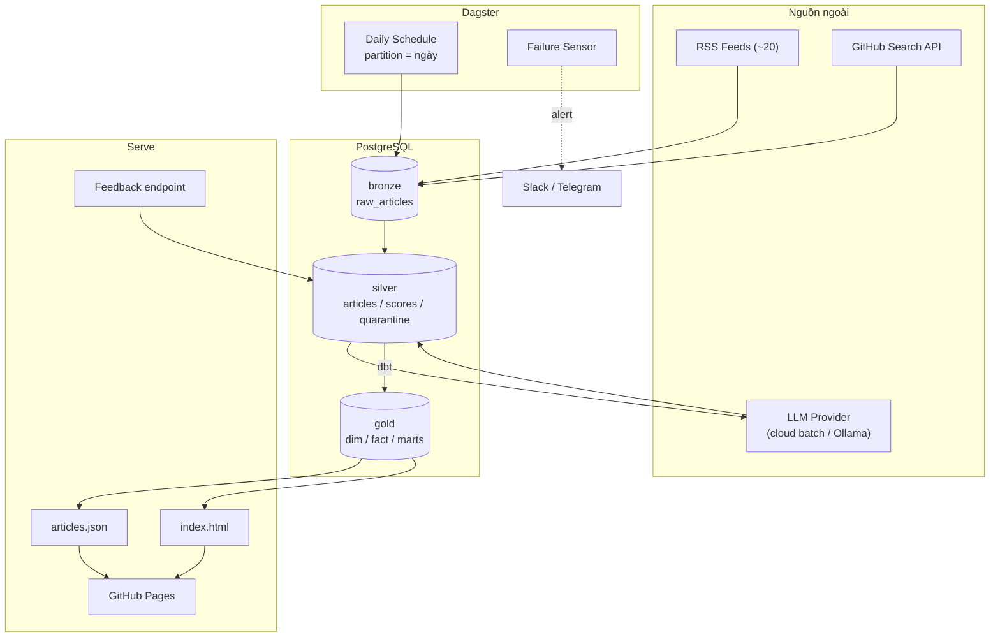
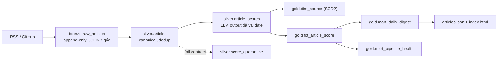
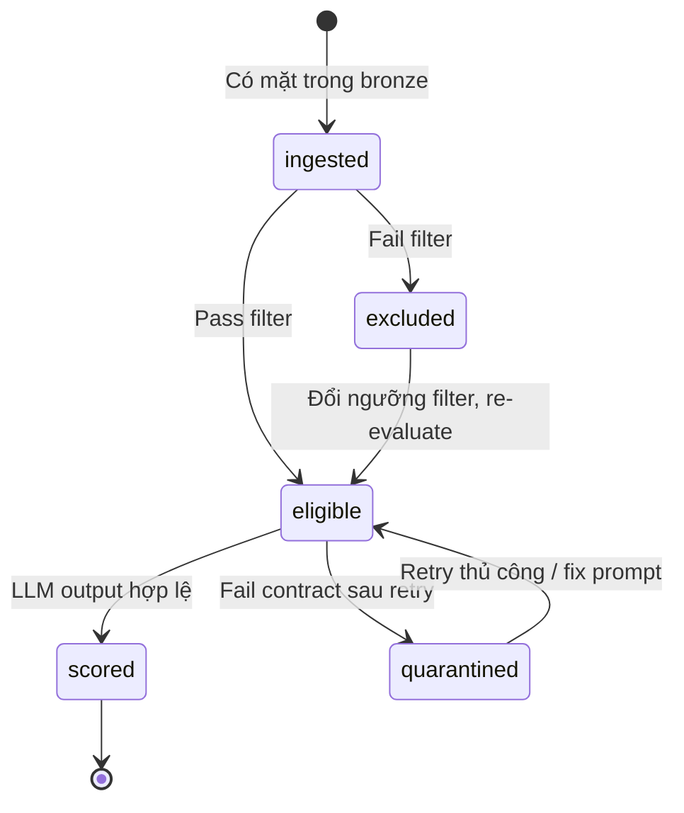
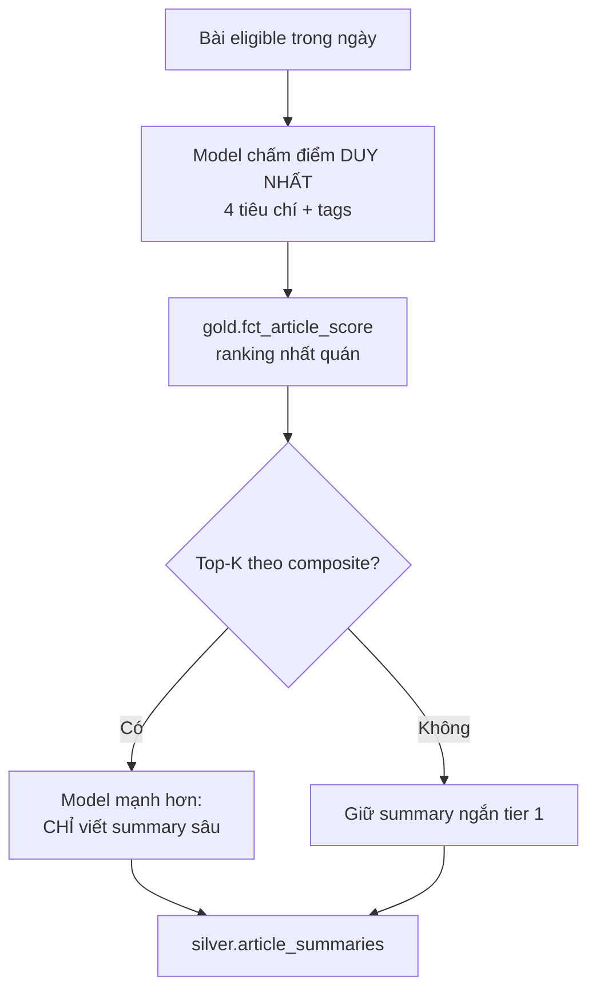
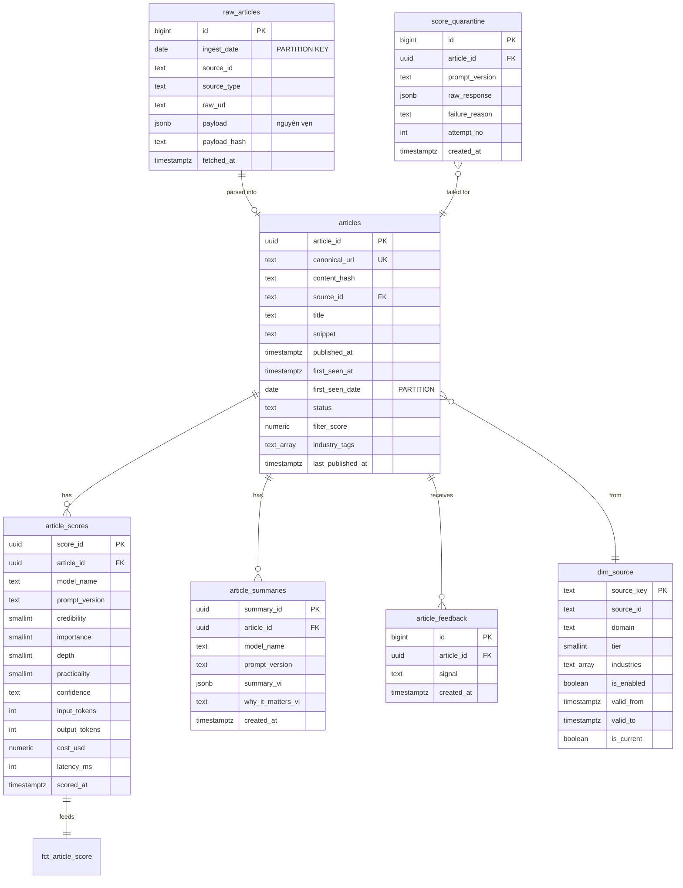
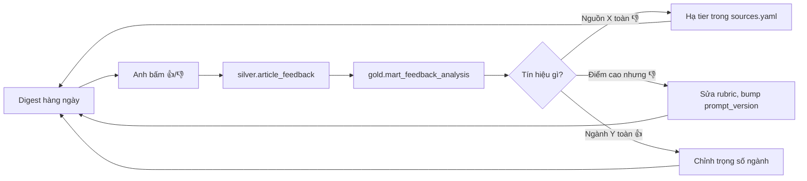

# Industry Intelligence Bot — Production Plan

> **Phiên bản tài liệu:** 2.0
> **Ngày cập nhật:** 2026-08-05
> **Thay thế:** v1.0 (2026-07-07)
> **Mục đích:** Kế hoạch xây dựng một **batch data pipeline chuẩn Data Engineering**, lấy bài toán tin tức ngành (AI, Construction, HVAC, Manufacturing, IoT) làm domain. Sản phẩm đầu ra là bản digest hàng ngày; sản phẩm nghề nghiệp là một project portfolio DE có thể mang đi phỏng vấn.

---

## Mục lục

1. [Định vị dự án](#1-định-vị-dự-án)
2. [Mục tiêu & phạm vi](#2-mục-tiêu--phạm-vi)
3. [Nguyên tắc thiết kế](#3-nguyên-tắc-thiết-kế)
4. [Kiến trúc hệ thống](#4-kiến-trúc-hệ-thống)
5. [Mô hình dữ liệu (Medallion)](#5-mô-hình-dữ-liệu-medallion)
6. [Cấu trúc repository](#6-cấu-trúc-repository)
7. [Orchestration với Dagster](#7-orchestration-với-dagster)
8. [Lớp Ingest (Bronze)](#8-lớp-ingest-bronze)
9. [Lớp Filter](#9-lớp-filter)
10. [Lớp Score — LLM as a Data Source](#10-lớp-score--llm-as-a-data-source)
11. [Lớp Transform (dbt: Silver → Gold)](#11-lớp-transform-dbt-silver--gold)
12. [Lớp Publish](#12-lớp-publish)
13. [Data Quality & Freshness SLA](#13-data-quality--freshness-sla)
14. [Feedback loop & Eval](#14-feedback-loop--eval)
15. [Cấu hình (Config-as-Code)](#15-cấu-hình-config-as-code)
16. [Hạ tầng & 3 kịch bản triển khai](#16-hạ-tầng--3-kịch-bản-triển-khai)
17. [CI/CD](#17-cicd)
18. [Observability & vận hành](#18-observability--vận-hành)
19. [Bảo mật & tuân thủ](#19-bảo-mật--tuân-thủ)
20. [Chiến lược kiểm thử](#20-chiến-lược-kiểm-thử)
21. [Quản lý chi phí](#21-quản-lý-chi-phí)
22. [Roadmap theo phase](#22-roadmap-theo-phase)
23. [Checklist vận hành](#23-checklist-vận-hành)
24. [Phụ lục](#24-phụ-lục)

---

## 1. Định vị dự án

### 1.1 Mô tả

Pipeline batch chạy hàng ngày: thu thập bài từ ~20 nguồn RSS và GitHub Search API → làm sạch và khử trùng lặp → chấm điểm + tóm tắt tiếng Việt bằng LLM → mô hình hóa thành các bảng phân tích → xuất bản trang digest tĩnh trên GitHub Pages.

| Bước | Tầng | Mô tả |
|------|------|-------|
| Extract | Bronze | Fetch RSS + GitHub, lưu payload gốc nguyên vẹn, partition theo ngày |
| Load & Clean | Silver | Canonical URL, dedup, chuẩn hoá schema, gắn nhãn ngành |
| Enrich | Silver | LLM chấm 4 tiêu chí + tóm tắt 5 bullet tiếng Việt, có data contract |
| Transform | Gold | dbt models: dim/fact, mart digest, mart analytics |
| Serve | Publish | JSON + HTML tĩnh, window 48h |

### 1.2 Định vị portfolio

Anh đã có một project lakehouse dùng Kafka + Spark + Airflow + Iceberg. Project đó chứng minh khả năng làm **streaming / big data**. Project này **không nên lặp lại** stack đó — nó phục vụ mục đích khác:

| Trục | Project lakehouse (đã có) | Project này |
|------|---------------------------|-------------|
| Paradigm | Streaming, distributed | Batch, single-node, đúng kích cỡ bài toán |
| Điểm mạnh thể hiện | Xử lý khối lượng lớn | **Kỷ luật vận hành, data modeling, data quality** |
| Công cụ bổ sung | — | **Dagster, dbt, data contract, DQ testing** |
| Chủ đề nóng 2026 | — | **LLM nằm trong pipeline sản xuất** |
| Câu chuyện | "Tôi build được hệ lớn" | "Tôi vận hành được hệ đáng tin cậy, và biết khi nào KHÔNG cần hệ lớn" |

Một trong những câu hỏi phỏng vấn DE khó nhất là *"tại sao chọn kiến trúc này?"*. Việc cố tình **không** dùng Spark cho 200 bản ghi/ngày, và giải thích được lý do, là tín hiệu chín chắn mạnh hơn việc dùng Spark ở mọi nơi.

### 1.3 Bốn năng lực DE mà project này chứng minh

| # | Năng lực | Hiện diện ở đâu trong project |
|---|----------|-------------------------------|
| 1 | **Idempotency & backfill** | Partition theo ngày, `MERGE` thay `INSERT`, `dagster asset backfill` chạy lại bất kỳ ngày nào |
| 2 | **Data modeling** | Medallion bronze/silver/gold; `dim_source` SCD Type 2; fact table dạng long |
| 3 | **Data quality** | dbt tests, freshness SLA, anomaly detection trên row count và phân phối điểm |
| 4 | **Data contract & dead-letter** | Schema Pydantic cho output LLM, bản ghi lỗi vào bảng quarantine thay vì làm chết job |

---

## 2. Mục tiêu & phạm vi

### 2.1 Mục tiêu

| ID | Mục tiêu | Chỉ số thành công | Cách đo |
|----|----------|-------------------|---------|
| G1 | Pipeline chạy tự động, không can thiệp tay | 14 ngày liên tiếp, 0 manual fix | Heartbeat ngoài + `pipeline_runs` |
| G2 | Dữ liệu đúng và đầy đủ | 100% dbt tests pass mỗi ngày | CI + dagster asset check |
| G3 | Digest đáng đọc | ≥ 60% bài top-10 được đánh dấu 👍 sau 4 tuần | Bảng `article_feedback` |
| G4 | Chi phí kiểm soát được | ≤ $10/tháng, có dashboard chi phí theo ngày | `llm_call_log` |
| G5 | Mọi lỗi debug được trong 10 phút | Có lineage từ bài lỗi ngược về payload gốc | Bronze giữ raw payload |
| G6 | Backfill được | Chạy lại 1 ngày bất kỳ trong 30 ngày cho kết quả nhất quán | Test backfill hàng tuần |

> **Khác biệt so với v1:** G3 của v1 (`user review ≥ 4/5 bài top-10`) là đánh giá chủ quan không lặp lại được. G3 mới đo bằng dữ liệu hành vi thật, tự tích luỹ, và chính nó trở thành eval set.

### 2.2 Trong phạm vi

- Ingest RSS + GitHub Search API (theo topic, không dùng global trending)
- Bronze layer append-only, giữ nguyên payload gốc
- Filter keyword; embedding filter là tùy chọn Phase 2
- Scoring LLM qua interface đa provider (cloud batch mặc định, Ollama local tuỳ chọn)
- Transform bằng dbt-core trên PostgreSQL
- Data quality tests + freshness SLA + anomaly detection
- Orchestration bằng Dagster (partition theo ngày, backfill, sensors)
- Publish static site GitHub Pages + feedback widget
- Cost tracking theo từng LLM call

### 2.3 Ngoài phạm vi (giai đoạn đầu)

- Scrape full-text sau paywall
- Streaming / real-time (bài toán này bản chất là batch hàng ngày)
- Multi-tenant, auth, user accounts
- Spark / distributed compute — **cố ý loại trừ, xem ADR-015**
- Tự động đăng lại nội dung gốc (rủi ro bản quyền)

---

## 3. Nguyên tắc thiết kế

| # | Nguyên tắc | Áp dụng cụ thể |
|---|------------|----------------|
| P1 | **Idempotency** | Mọi asset có partition key = ngày; chạy lại một partition ghi đè đúng phạm vi đó, không đụng ngày khác |
| P2 | **Raw is immutable** | Bronze không bao giờ UPDATE/DELETE. Sai sót được sửa ở silver bằng cách chạy lại transform |
| P3 | **Schema on write cho contract, schema on read cho payload** | Payload RSS gốc lưu JSONB; các trường đã parse có kiểu chặt và constraint |
| P4 | **Fail loud, không fail silent** | Bản ghi không thoả contract → vào `quarantine`, đếm được, alert khi vượt ngưỡng |
| P5 | **Separation of compute và transform** | Python lo I/O và LLM; SQL (dbt) lo business logic. Không nhúng logic tính điểm vào Python |
| P6 | **Observability by default** | Mọi asset ghi metadata (row count, cost, latency) vào Dagster + bảng log |
| P7 | **Reproducibility** | Pin dependency, version prompt, version dbt model, migration có thứ tự |
| P8 | **Đúng kích cỡ** | Không thêm công cụ nào trước khi dữ liệu chứng minh cần nó |

---

## 4. Kiến trúc hệ thống

### 4.1 Tổng thể



### 4.2 Luồng dữ liệu theo tầng



### 4.3 Vòng đời bài viết (đã sửa lỗi của v1)



> **Sửa lỗi 1 (v1).** v1 có trạng thái `published`, khiến bài đã lên trang bị loại khỏi query window 48h ở lần chạy hôm sau. **v2 bỏ hẳn `published` khỏi state machine.** Việc hiển thị không phải là một trạng thái xử lý — nó là kết quả của một truy vấn trên `gold.mart_daily_digest` với điều kiện thời gian. Muốn biết bài đã lên trang chưa thì đọc cột `last_published_at`, không đọc `status`.
>
> **Sửa lỗi 5 (v1).** `excluded → eligible` là đường mà v1 thiếu. Kèm theo đó, `silver.articles` lưu luôn `filter_score` dạng số, nên khi đổi ngưỡng chỉ cần chạy lại một model dbt, không cần encode lại embedding.

### 4.4 Scoring — bỏ cascade re-score



> **Sửa lỗi 2 (v1).** v1 để model 7B chấm điểm rồi model 14B **chấm lại** cho bài importance ≥ 7. Hệ quả: bảng xếp hạng cuối trộn điểm của hai model có thang khác nhau, nên thứ hạng phản ánh *model nào đã chấm* chứ không chỉ *nội dung*. Ngoài ra model yếu nhất lại đóng vai người gác cổng — bài quan trọng bị tier 1 cho 5 điểm thì vĩnh viễn không được xét lại.
>
> **v2 tách bạch:** **điểm số** do đúng một model sinh ra cho toàn bộ bài trong ngày (ranking so sánh được); **tóm tắt** mới là thứ được nâng cấp cho top-K. Hai thứ này nằm ở hai bảng khác nhau và không ảnh hưởng lẫn nhau.

---

## 5. Mô hình dữ liệu (Medallion)

### 5.1 Sơ đồ quan hệ



### 5.2 Bronze — `bronze.raw_articles`

Append-only. Không bao giờ sửa. Đây là bảo hiểm cho mọi lỗi parse về sau.

| Cột | Kiểu | Ghi chú |
|-----|------|---------|
| `id` | BIGSERIAL | |
| `ingest_date` | DATE | **Partition key**, = ngày chạy job theo Asia/Ho_Chi_Minh |
| `source_id` | TEXT | |
| `source_type` | TEXT | `rss` / `github` |
| `raw_url` | TEXT | URL chưa chuẩn hoá |
| `payload` | JSONB | Toàn bộ entry gốc từ feedparser / GitHub API |
| `payload_hash` | TEXT | SHA-256 của payload — dedup ở tầng bronze |
| `fetched_at` | TIMESTAMPTZ | |

**Idempotency:** unique `(ingest_date, payload_hash)`. Chạy lại job của ngày X ghi lại đúng partition ngày X.

**Index:** `(ingest_date)`, `(source_id, ingest_date)`.

> **Vì sao có tầng bronze mà v1 không có:** khi phát hiện normalizer bóc sai trường `published_at` của một feed, v1 phải chờ feed publish bài mới mới sửa được. v2 chạy lại transform trên bronze là có dữ liệu đúng cho toàn bộ lịch sử. Đây là lập luận trung tâm của kiến trúc medallion và là câu trả lời sẵn cho câu hỏi phỏng vấn *"tại sao phải lưu raw?"*.

### 5.3 Silver — `silver.articles`

| Cột | Kiểu | Mô tả |
|-----|------|-------|
| `article_id` | UUID | PK, sinh xác định từ `canonical_url` (UUIDv5) — **không random**, để backfill idempotent |
| `canonical_url` | TEXT UNIQUE | Khoá dedup cấp 1 |
| `content_hash` | TEXT | `lower(trim(title))` + domain — dedup cấp 2 |
| `source_id` | TEXT | FK → `dim_source` |
| `title`, `snippet` | TEXT | |
| `published_at` | TIMESTAMPTZ | Từ feed; NULL nếu feed không có |
| `first_seen_at` | TIMESTAMPTZ | Lần đầu xuất hiện ở bronze |
| `first_seen_date` | DATE | Partition cho các model dbt incremental |
| `status` | TEXT | `ingested` / `eligible` / `excluded` / `scored` / `quarantined` |
| `filter_score` | NUMERIC(5,4) | **Điểm số của filter, không phải chỉ pass/fail** |
| `exclusion_reason` | TEXT | `keyword_miss`, `similarity_low`, `too_old` |
| `industry_tags` | TEXT[] | |
| `last_published_at` | TIMESTAMPTZ | Lần cuối bài này xuất hiện trên trang digest |

**Index:** `canonical_url` (unique), `content_hash`, `(status, first_seen_at)`, `(first_seen_date)`.

### 5.4 Silver — `article_scores` và `article_summaries`

**Tách làm hai bảng** vì hai thứ này có vòng đời khác nhau (xem 4.4): điểm dùng để xếp hạng và phải nhất quán; tóm tắt có thể được viết lại bằng model mạnh hơn mà không đụng đến điểm.

`article_scores` bổ sung so với v1: `input_tokens`, `output_tokens`, `cost_usd`. Ba cột này biến việc kiểm soát chi phí từ ước lượng thành truy vấn SQL.

**Unique constraint:** `(article_id, prompt_version, model_name)`. v1 thiếu ràng buộc này nên chạy lại job sinh row trùng.

> **Sửa lỗi 7 (v1).** v1 không định nghĩa tier cloud ghi gì vào `article_scores`: nếu Gemini chỉ "polish summary" thì row đó mang điểm nào? v2 không còn câu hỏi này — summary nằm ở bảng riêng, không có cột điểm.

### 5.5 Silver — `score_quarantine` (dead letter)

Bản ghi LLM trả về không thoả contract sau N lần retry đi vào đây, **kèm nguyên văn response**. Job không chết, không mark hàng loạt `failed`, và anh có mẫu thật để sửa prompt.

| Cột | Mô tả |
|-----|-------|
| `article_id`, `prompt_version` | |
| `raw_response` | JSONB — nguyên văn, kể cả khi không parse được JSON thì lưu dạng `{"text": "..."}` |
| `failure_reason` | `json_parse_error`, `schema_violation`, `out_of_range`, `timeout` |
| `attempt_no` | |

**Đây là pattern được hỏi nhiều trong phỏng vấn DE.** Câu hỏi *"khi một record lỗi thì bạn làm gì?"* — trả lời "quarantine + đếm + alert theo tỷ lệ, không chặn cả batch" là câu trả lời đúng.

### 5.6 Gold — `dim_source` (SCD Type 2)

Tier uy tín của một nguồn thay đổi theo thời gian (một tạp chí xuống chất lượng, một blog lên hạng). Nếu UPDATE trực tiếp thì điểm credibility lịch sử không còn tái tạo được.

| Cột | Mô tả |
|-----|-------|
| `source_key` | Surrogate key |
| `source_id` | Natural key |
| `domain`, `tier`, `industries`, `is_enabled` | Thuộc tính |
| `valid_from`, `valid_to` | Khoảng hiệu lực |
| `is_current` | Boolean tiện query |

Khi `config/sources.yaml` đổi tier, dbt snapshot đóng bản ghi cũ và mở bản ghi mới. Điểm của bài cũ vẫn join đúng bản ghi tier tại thời điểm chấm.

### 5.7 Gold — `fct_article_score` và công thức điểm

| Thành phần | Trọng số | Ghi chú |
|------------|----------|---------|
| `importance` | 40% | Tiêu chí chính |
| `practicality` | 30% | Áp dụng được ở VN / SME |
| `credibility` | 30% | Xem dưới |
| ~~`depth`~~ | **0% ở Phase 0–1** | Xem ghi chú |
| Recency boost | +0 → +1.0 | Theo `published_at`; NULL thì dùng `first_seen_at`, và trừ 0.3 vì độ tin cậy thấp hơn |

**Recency:** `published_at` trong 12h → +1.0; 24h → +0.5; còn lại 0.
v1 không nói rõ dùng field nào; với bài ingest lúc 18h nhưng chấm sáng hôm sau thì hai field lệch nhau đáng kể.

> **Sửa lỗi 3 (v1).** Rubric v1 định nghĩa `depth` là "case study, số liệu, technical detail" nhưng input cho LLM chỉ là snippet RSS 2–3 câu. Không thể đánh giá độ sâu của một bài từ phần mô tả của nó — thực tế model sẽ chấm theo độ dài snippet. Mà `depth` chiếm 20% composite trong v1, tức 20% thứ hạng đến từ một tín hiệu nhiễu. **v2 để trọng số 0 và chỉ bật lại sau khi có full-text fetch.** Vẫn ghi điểm vào bảng để so sánh về sau, chỉ là không dùng để xếp hạng.
>
> **Sửa lỗi 4 (v1).** v1 blend credibility 60% LLM / 40% source tier. Ngược. Domain của nguồn là tín hiệu cứng, miễn phí, chính xác; một model nhỏ đọc 2 câu snippet không có cơ sở gì để phán uy tín. **v2 dùng 80% source tier / 20% LLM**, và ghi rõ đây là giả thuyết cần kiểm chứng bằng feedback ở Phase 2.

### 5.8 Gold — `mart_daily_digest` và `mart_pipeline_health`

`mart_daily_digest`: một dòng một bài trong window 48h, đã dedup theo `content_hash` (giữ bài điểm cao nhất), đã sort, đã group theo ngành. Publish job chỉ việc `SELECT * FROM gold.mart_daily_digest` rồi render — **không còn business logic trong Python.**

`mart_pipeline_health`: một dòng một ngày, các cột: số bài ingest, số eligible, tỷ lệ excluded, số quarantine, tổng cost, latency p50/p95, số nguồn fail. Đây là bảng để vẽ dashboard và cũng là bảng để anh mở ra khi phỏng vấn.

---

## 6. Cấu trúc repository

```
industry-intel-bot/
├── .github/workflows/
│   ├── ci.yml                      # lint, mypy, pytest, dbt parse, sqlfluff
│   └── deploy-pages.yml
│
├── dagster_project/
│   ├── definitions.py              # Definitions: assets, schedules, sensors, resources
│   ├── assets/
│   │   ├── bronze.py               # raw_rss, raw_github
│   │   ├── silver.py               # articles, scores, summaries
│   │   └── dbt.py                  # load_assets_from_dbt_project
│   ├── resources/
│   │   ├── postgres.py
│   │   ├── llm.py                  # LLMResource: cloud | ollama
│   │   └── notifier.py
│   ├── sensors.py                  # failure sensor, freshness sensor
│   └── schedules.py
│
├── dbt_project/
│   ├── dbt_project.yml
│   ├── models/
│   │   ├── staging/
│   │   │   ├── stg_articles.sql
│   │   │   └── stg_article_scores.sql
│   │   ├── intermediate/
│   │   │   ├── int_articles_deduped.sql
│   │   │   └── int_scores_latest.sql
│   │   └── marts/
│   │       ├── dim_source.sql
│   │       ├── fct_article_score.sql
│   │       ├── mart_daily_digest.sql
│   │       └── mart_pipeline_health.sql
│   ├── snapshots/
│   │   └── snap_sources.sql        # SCD2
│   ├── tests/
│   │   ├── assert_no_future_published_at.sql
│   │   ├── assert_score_range.sql
│   │   └── assert_digest_not_empty.sql
│   └── macros/
│
├── src/intel_bot/
│   ├── cli.py                      # Typer: ingest, score, publish, doctor, backfill
│   ├── config.py                   # Pydantic Settings
│   ├── contracts/
│   │   ├── llm_score.py            # Pydantic model — DATA CONTRACT
│   │   └── article.py
│   ├── ingest/
│   │   ├── rss_fetcher.py
│   │   ├── github_fetcher.py
│   │   └── normalizer.py
│   ├── filter/
│   │   └── keyword_filter.py
│   ├── score/
│   │   ├── providers/
│   │   │   ├── base.py             # interface
│   │   │   ├── gemini.py           # có batch mode
│   │   │   └── ollama.py
│   │   ├── prompt_builder.py
│   │   └── cost.py                 # token → USD theo bảng giá config
│   ├── publish/
│   │   ├── json_exporter.py
│   │   ├── html_renderer.py
│   │   └── feedback_collector.py
│   └── observability/
│       └── logging.py              # structlog JSON
│
├── config/
│   ├── sources.yaml
│   ├── keywords.yaml
│   ├── rubric.yaml
│   ├── models.yaml                 # provider routing + BẢNG GIÁ token
│   ├── source_tiers.yaml
│   └── app.yaml
│
├── prompts/
│   ├── score_v2.0.0.md
│   └── summary_v2.0.0.md
│
├── migrations/                     # Alembic
├── templates/                      # Jinja2
├── tests/{unit,integration,fixtures}/
├── docs/
│   ├── PRODUCTION_PLAN.md
│   ├── ARCHITECTURE.md
│   ├── RUNBOOK.md
│   ├── INTERVIEW_NOTES.md          # ← xem 24.4
│   └── ADR/
├── docs-site/                      # GitHub Pages output
├── pyproject.toml
└── .env.example
```

---

## 7. Orchestration với Dagster

### 7.1 Vì sao thay GitHub Actions cron

| Nhu cầu | GitHub Actions cron (v1) | Dagster (v2) |
|---------|--------------------------|--------------|
| Backfill 1 ngày cụ thể | Viết tay CLI flag | Có sẵn, chọn partition trên UI |
| Biết asset nào stale | Không | Freshness policy |
| Retry một bước, không chạy lại cả pipeline | Không | Có, theo asset |
| Lineage | Không | Đồ thị asset tự sinh |
| Kể chuyện phỏng vấn DE | Yếu | Mạnh |

Anh đã dùng Airflow ở project trước. Chọn Dagster ở đây để có hai orchestrator trong CV và vì mô hình asset hợp với bài toán này hơn mô hình task. Nếu muốn củng cố Airflow thay vì học tool mới, toàn bộ thiết kế trong tài liệu này chuyển sang Airflow được — chỉ cần đổi từ asset sang task + dataset, giữ nguyên partition theo ngày.

### 7.2 Asset graph

| Asset | Tầng | Partition | Phụ thuộc | Compute |
|-------|------|-----------|-----------|---------|
| `raw_rss` | bronze | daily | — | Python |
| `raw_github` | bronze | daily | — | Python |
| `stg_articles` | silver | daily | raw_rss, raw_github | dbt |
| `articles_filtered` | silver | daily | stg_articles | Python |
| `article_scores` | silver | daily | articles_filtered | Python + LLM |
| `article_summaries` | silver | daily | article_scores | Python + LLM |
| `dim_source` | gold | — | snapshot | dbt |
| `fct_article_score` | gold | daily | article_scores, dim_source | dbt |
| `mart_daily_digest` | gold | — | fct_article_score | dbt |
| `mart_pipeline_health` | gold | daily | tất cả | dbt |
| `published_site` | serve | — | mart_daily_digest | Python |

### 7.3 Lịch chạy

| Giờ (UTC+7) | Asset chạy | Ghi chú |
|-------------|-----------|---------|
| 05:00 | Toàn bộ graph cho partition hôm nay | Job chính |
| 12:00, 18:00 | Chỉ `raw_*` + `stg_articles` | Ingest bổ sung, chưa tốn LLM |
| 05:00 hôm sau | Bài ingest chiều qua được chấm | Vẫn trong window 48h nhờ `first_seen_at` |
| Chủ nhật 03:00 | Backfill test 1 partition ngẫu nhiên trong 30 ngày | Kiểm chứng G6 |

### 7.4 Sensors

| Sensor | Kích hoạt | Hành động |
|--------|-----------|-----------|
| `run_failure_sensor` | Bất kỳ run fail | Gửi Slack/Telegram kèm link Dagster UI |
| `freshness_sensor` | `mart_daily_digest` chưa cập nhật > 26h | Alert critical |
| `quarantine_sensor` | Tỷ lệ quarantine > 10% trong ngày | Alert warning |
| `cost_sensor` | Cost tích luỹ tháng > 80% ngân sách | Alert + tự chuyển sang model rẻ hơn |

### 7.5 Heartbeat ngoài — điểm mù lớn nhất của v1

v1 dựa vào chính máy chạy pipeline để gửi alert. Nếu máy đó tắt, sleep, hoặc mất mạng thì **không có alert nào được gửi, và sự im lặng bị hiểu nhầm là mọi thứ bình thường.** Đây là lỗi vận hành nghiêm trọng hơn mọi bug code trong plan.

**v2 bắt buộc:** cuối job thành công, gọi HTTP tới một dịch vụ dead-man's-switch bên ngoài (healthchecks.io hoặc tương đương, tier free đủ dùng). Nếu quá 26h không nhận được ping, dịch vụ đó gửi email cho anh. Đây là thứ duy nhất phát hiện được sự cố "pipeline không hề chạy".

---

## 8. Lớp Ingest (Bronze)

### 8.1 RSS Fetcher

| Hạng mục | Thiết kế |
|----------|----------|
| HTTP client | httpx async, timeout 30s, max 5 concurrent |
| Parser | feedparser |
| User-Agent | Chuỗi định danh rõ + email liên hệ |
| Conditional GET | Lưu `ETag` / `Last-Modified` theo source → giảm băng thông và tôn trọng nguồn |
| Ghi bronze | Toàn bộ entry dạng JSONB, không lọc trường |
| Lỗi | Bắt theo từng source; ghi vào `source_health`; không làm chết asset |

### 8.2 Cold start — lỗi số 6 của v1

Lần chạy đầu tiên, nhiều feed trả về 20–50 bài cũ. Với `first_seen_at = hôm nay`, toàn bộ backlog rơi vào window 48h và đi qua LLM cùng lúc — vừa tốn tiền vừa cho ra một trang digest toàn tin cũ.

**Quy tắc bắt buộc ở tầng ingest:**

```
Nếu published_at IS NOT NULL AND published_at < now() - 7 ngày
  → status = 'excluded', exclusion_reason = 'too_old'
  (vẫn ghi vào bronze — chỉ không đi tiếp)
Nếu published_at IS NULL
  → dùng first_seen_at, và đánh dấu cờ published_at_imputed = true
```

Bài vẫn nằm ở bronze để về sau phân tích được, chỉ là không tốn LLM.

### 8.3 URL Normalizer

- Lowercase scheme + host, bỏ `www.`
- Bỏ query params: `utm_*`, `fbclid`, `gclid`, `ref`, `source`
- Bỏ trailing slash và fragment
- GitHub: rút về `https://github.com/{owner}/{repo}`
- **Ghi lại cả `raw_url` lẫn `canonical_url`** để debug được khi dedup sai

### 8.4 Dedup

| Cấp | Khoá | Nơi thực thi | Hành vi |
|-----|------|--------------|---------|
| 0 | `payload_hash` | bronze | Không ghi trùng trong cùng ngày |
| 1 | `canonical_url` | silver | `MERGE` — giữ `first_seen_at` sớm nhất |
| 2 | `content_hash` | gold (dbt) | Giữ bản có `composite_score` cao nhất, log số lượng gộp |

Dedup cấp 2 làm ở dbt chứ không ở Python: nó là business logic, và viết bằng `QUALIFY`/`ROW_NUMBER()` thì vừa ngắn vừa test được.

### 8.5 Danh sách nguồn

Giữ nguyên 15 nguồn đề xuất của v1, bổ sung tới ~20. Trước khi đưa vào `sources.yaml`, chạy `intel-bot validate-sources` để kiểm tra: URL trả 200, parse được, có ≥ 1 entry, có trường ngày.

---

## 9. Lớp Filter

### 9.1 Thay đổi lớn: embedding filter lùi xuống Phase 2

Tính lại khối lượng thật: ~20 feed × ~10 bài/ngày ≈ **200 bài/ngày**. Đây là con số nhỏ. Với cloud batch API, chấm hết 200 bài tốn vài xu và vài phút. Filter không tiết kiệm được gì đáng kể ở quy mô này.

Thêm nữa, keyword filter trên feed chuyên ngành gần như là no-op: bài nào của ACHR News chẳng match keyword HVAC. Điều kiện của v1 — *"match ≥ 1 keyword AND (source industry overlap HOẶC match ≥ 2 groups)"* — có vế thứ hai gần như luôn đúng vì nguồn đã được chọn theo ngành.

**Nhận định cần nói thẳng:** vấn đề của anh không phải *relevance*, nó là *importance*. Và importance thì chỉ LLM đánh giá được. Xây hai tầng filter trước khi biết LLM chấm điểm có phân biệt được hay không là tối ưu hoá quá sớm.

### 9.2 Phase 0–1: filter tối thiểu

| Quy tắc | Mục đích |
|---------|----------|
| Loại bài `published_at` > 7 ngày | Chống cold start |
| Loại bài snippet < 80 ký tự | Không đủ dữ liệu để chấm |
| Loại theo blocklist keyword (`webinar`, `sponsored`, `job posting`) | Rác rõ ràng |
| Cap `max_articles_per_day` từ config | Trần chi phí cứng |

Ghi `filter_score` = 1.0 cho bài pass, 0.0 cho bài bị loại, để cấu trúc bảng không đổi khi Phase 2 thêm embedding.

### 9.3 Phase 2: embedding filter (nếu dữ liệu chứng minh cần)

Chỉ thêm khi `mart_pipeline_health` cho thấy > 400 bài/ngày, hoặc feedback cho thấy nhiễu chủ đề cao.

| Hạng mục | Thiết kế |
|----------|----------|
| Model | `bge-small-en-v1.5` local |
| Anchor | `config/interest_profile.txt` |
| **Lưu điểm số** | `articles.filter_score` = cosine similarity, **không** chỉ pass/fail |
| Ngưỡng | Áp dụng ở tầng dbt, không ở Python |

> **Sửa lỗi 5 (v1).** Vì `filter_score` là số và ngưỡng nằm ở dbt, đổi ngưỡng chỉ cần `dbt run --select int_articles_deduped+` — không encode lại gì cả. v1 chỉ lưu `rejection_reason='embedding_low'`, nên mỗi lần tune ngưỡng phải chạy lại toàn bộ embedding.

---

## 10. Lớp Score — LLM as a Data Source

### 10.1 Nguyên tắc

LLM trong pipeline này được đối xử **y như một API bên thứ ba không đáng tin**: có contract, có validation, có retry, có dead letter, có đo chi phí và độ trễ. Đây chính là góc nhìn khiến project này có giá trị kể chuyện — phần lớn ứng viên nói về LLM như một tính năng, rất ít người nói về nó như một nguồn dữ liệu cần quản trị.

### 10.2 Provider routing — không khoá vào phần cứng

Anh chưa quyết máy chạy. Vì vậy **kiến trúc không được giả định có GPU**. Toàn bộ scoring đi qua một interface:

```
class LLMProvider(Protocol):
    def score_batch(self, items: list[ScoreRequest]) -> list[ScoreResult]: ...
    def estimate_cost(self, items) -> Decimal: ...
```

| Provider | Khi nào dùng | Ưu | Nhược |
|----------|--------------|-----|-------|
| `gemini_batch` | **Mặc định** | Không cần phần cứng, giá batch giảm ~50%, chạy được ở bất kỳ đâu | Tốn tiền, phụ thuộc mạng |
| `ollama` | Khi đã có máy 24/7 | Chi phí biên ~0, dữ liệu không rời máy | Cần GPU, cần máy luôn bật |
| `mock` | Test / CI | Nhanh, xác định | — |

Đổi provider = đổi một dòng trong `models.yaml`. Quyết định về phần cứng vì thế **không còn chặn tiến độ** — anh bắt đầu bằng cloud, và nếu sau này mua máy thì chuyển sang Ollama mà không sửa pipeline.

> **Cảnh báo cụ thể về v1:** plan v1 chỉ định `gemini-2.0-flash`. Model này đã bị Google ngừng phục vụ từ 01/06/2026. Danh sách model trong `models.yaml` cần kiểm tra lại tại trang pricing chính thức trước khi code, và nên coi tên model là **giá trị config, không phải hằng số trong code** — các model Gemini 2.5 cũng đã có lịch ngừng phục vụ trong năm nay.

### 10.3 Batch API — quyết định thiết kế đáng nói

Pipeline này chạy 05:00 sáng và người dùng đọc digest lúc 07:00. **Độ trễ 30–60 phút hoàn toàn chấp nhận được.** Vì vậy dùng Batch API thay vì synchronous API: giá giảm khoảng một nửa, và bản chất workload là batch nên đây là lựa chọn tự nhiên chứ không phải thoả hiệp.

Luồng: submit batch job lúc 05:00 → Dagster sensor poll trạng thái → khi xong thì asset `article_scores` materialize → các asset phía sau chạy tiếp.

### 10.4 Data contract cho output LLM

| Field | Kiểu | Bắt buộc | Ràng buộc |
|-------|------|----------|-----------|
| `credibility` | int | Có | 1–10 |
| `importance` | int | Có | 1–10 |
| `depth` | int | Có | 1–10 (ghi nhưng trọng số 0) |
| `practicality` | int | Có | 1–10 |
| `industry_tags` | string[] | Có | Tập đóng: ai, construction, hvac, manufacturing, iot |
| `confidence` | enum | Có | high / medium / low |
| `is_breaking` | bool | Không | |

Summary tách sang contract riêng:

| Field | Kiểu | Ràng buộc |
|-------|------|-----------|
| `summary_vi` | string[] | Đúng 5 phần tử, mỗi phần tử 15–200 ký tự |
| `why_it_matters_vi` | string | 20–300 ký tự |

**Validation bằng Pydantic. Vi phạm → quarantine, không phải exception.**

### 10.5 Xử lý lỗi

| Lỗi | Hành vi |
|-----|---------|
| JSON không parse được | Retry 1 lần với instruction chặt hơn |
| Schema violation | Retry 1 lần; lần 2 → quarantine |
| Điểm ngoài 1–10 | Quarantine ngay, không clamp — clamp là che giấu lỗi |
| Tag ngoài tập đóng | Bỏ tag lạ, ghi warning, giữ bản ghi |
| Provider timeout | Retry 2 lần, exponential backoff |
| Provider down | Asset fail, alert, **không** mark bài là quarantined hàng loạt |
| Vượt ngân sách ngày | Dừng chấm, giữ nguyên bài ở `eligible` để hôm sau chấm tiếp |

### 10.6 Rubric

Giữ cấu trúc rubric v1 (định nghĩa rõ mốc 1 / 5 / 10) với hai điều chỉnh:

1. **Bỏ tiêu chí depth khỏi công thức xếp hạng** cho tới khi có full-text (mục 5.7)
2. **Thêm ràng buộc chống dồn điểm:** trong cùng một batch, yêu cầu model phân bố điểm importance sao cho không quá 30% bài đạt ≥ 8. Nếu phân phối thực tế lệch mạnh, `mart_pipeline_health` sẽ phát hiện và cảnh báo (mục 13.3).

### 10.7 Prompt versioning

| Version | Nội dung | Phase |
|---------|----------|-------|
| `score_v2.0.0` | Rubric 3 tiêu chí tính điểm + tags | Phase 0 |
| `summary_v2.0.0` | 5 bullet VI + why it matters | Phase 0 |
| `score_v2.1.0` | Hiệu chỉnh sau vòng feedback đầu | Phase 2 |

Quy tắc: mỗi row `article_scores` mang `prompt_version` và `model_name`. Không bao giờ UPDATE điểm cũ. Đổi rubric → bump version → chỉ chấm lại khi chạy backfill có chủ đích.

---

## 11. Lớp Transform (dbt: Silver → Gold)

### 11.1 Vì sao thêm dbt

Đây là bổ sung quan trọng nhất về mặt hồ sơ nghề nghiệp. dbt xuất hiện trong phần lớn JD Data Engineer hiện nay, và project lakehouse của anh chưa có nó. Về mặt kỹ thuật, nó cũng đúng: logic dedup, xếp hạng, window 48h, SCD — tất cả đều là SQL, và viết bằng SQL thì ngắn hơn, test được, và có lineage.

### 11.2 Phân tầng model

| Tầng | Model | Materialization | Vai trò |
|------|-------|-----------------|---------|
| staging | `stg_articles`, `stg_article_scores` | view | Đổi tên cột, ép kiểu, không có business logic |
| intermediate | `int_articles_deduped` | ephemeral | Dedup cấp 2 theo `content_hash` |
| intermediate | `int_scores_latest` | ephemeral | Lấy score mới nhất theo `(article_id, prompt_version)` |
| marts | `dim_source` | table (từ snapshot) | SCD2 |
| marts | `fct_article_score` | **incremental** theo `first_seen_date` | Bảng fact chính |
| marts | `mart_daily_digest` | table | Đầu vào trực tiếp của publish |
| marts | `mart_pipeline_health` | incremental | Metrics vận hành |

### 11.3 Incremental strategy

`fct_article_score` dùng `incremental_strategy='merge'` với `unique_key='score_id'`, lọc theo `first_seen_date >= (select max(first_seen_date) - 3 from {{ this }})`. Cửa sổ 3 ngày để bắt bài đến muộn mà không quét lại toàn bảng. Chạy lại một ngày cụ thể bằng `--vars '{run_date: 2026-08-01}'` → idempotent.

### 11.4 Snapshot cho `dim_source`

```

  strategy = 'check', check_cols = ['tier', 'is_enabled', 'industries']

```

Mỗi khi `sources.yaml` được seed vào DB và có thay đổi, snapshot ghi bản ghi mới với `dbt_valid_from` / `dbt_valid_to`.

---

## 12. Lớp Publish

### 12.1 Publish không còn chứa logic

Toàn bộ việc chọn bài, dedup, xếp hạng, nhóm theo ngành đã xong ở `mart_daily_digest`. Publish job chỉ còn: query → render Jinja2 → ghi file → commit → ping heartbeat → update `last_published_at`.

Đây là hệ quả của P5. Nó cũng giải quyết triệt để lỗi số 1: không còn trạng thái nào bị đổi bởi hành vi hiển thị.

### 12.2 Window và archive

| Tuổi bài | Hành vi |
|----------|---------|
| 0–48h (theo `first_seen_at`) | Trang chính |
| 2–7 ngày | `docs-site/archive/YYYY-MM-DD.json` |
| > 7 ngày | Chỉ còn trong Postgres, truy vấn được |

### 12.3 Feedback widget — thay thế eval set thủ công

Mỗi article card có hai nút 👍 / 👎.

| Hạng mục | Thiết kế |
|----------|----------|
| Cơ chế | Trang tĩnh → không có backend. Dùng GitHub Issues API qua một PAT scope hẹp, hoặc một Cloudflare Worker free tier ghi vào Postgres |
| Phương án đơn giản nhất Phase 0 | Nút copy `article_id` vào clipboard, anh dán vào một file; xấu nhưng chạy được ngay |
| Phương án Phase 2 | Worker → `silver.article_feedback` |
| Dùng để làm gì | Chính là eval set: nhãn relevant/not do hành vi thật sinh ra, tự tích luỹ, không tốn buổi tối nào |

> **Vì sao thay eval set 100 bài label tay của v1:** label 100 bài rồi +20 bài/tháng là một cam kết công sức lớn, và trong thực tế thường bị bỏ sau tuần thứ ba, kéo theo cả eval loop chết. Nút 👍/👎 tốn 1 giây mỗi ngày và phản ánh đúng gu của anh chứ không phải phán đoán của anh về gu của mình.

### 12.4 Trang có gì

| Thành phần | Ghi chú |
|------------|---------|
| Header | Ngày, số bài, thời điểm chạy pipeline |
| Section theo ngành | AI, Construction, HVAC, Manufacturing, IoT |
| Article card | Title (link gốc), badge nguồn + tier, thanh điểm, 5 bullet VI, "Tại sao quan trọng", 👍/👎, **checkbox "đã đọc"** (lưu ở `localStorage`) |
| Footer | Disclaimer AI-generated, link repo, link dashboard health |

---

## 13. Data Quality & Freshness SLA

Đây là chương mà v1 không có, và là chương tạo khác biệt lớn nhất về mặt DE.

### 13.1 dbt tests — schema level

| Model | Test |
|-------|------|
| `stg_articles` | `unique(canonical_url)`, `not_null(article_id, source_id, title)` |
| `stg_articles` | `accepted_values(status)` |
| `stg_article_scores` | `not_null` tất cả cột điểm, `accepted_values(confidence)` |
| `fct_article_score` | `relationships(article_id → stg_articles)` |
| `dim_source` | `unique(source_key)`, đúng 1 dòng `is_current` mỗi `source_id` |

### 13.2 dbt tests — business level (singular tests)

| Test | Kỳ vọng |
|------|---------|
| `assert_score_range` | Mọi điểm nằm trong 1–10 |
| `assert_no_future_published_at` | Không có `published_at > now() + 1h` |
| `assert_digest_not_empty` | `mart_daily_digest` có ≥ 5 dòng |
| `assert_summary_five_bullets` | Mọi `summary_vi` có đúng 5 phần tử |
| `assert_no_orphan_scores` | Mọi score trỏ tới article tồn tại |

### 13.3 Anomaly detection — phần đáng nói nhất

| Kiểm tra | Ngưỡng | Vì sao quan trọng |
|----------|--------|-------------------|
| Row count ingest hôm nay | Lệch > 3σ so với trung bình 14 ngày | Phát hiện feed chết hoặc feed spam |
| Tỷ lệ quarantine | > 10% | Prompt hỏng hoặc provider đổi hành vi |
| Mean `importance` | Lệch > 1.0 so với trung bình 7 ngày | **Model drift** — provider âm thầm đổi version model |
| Độ lệch chuẩn `importance` | < 0.8 | Model dồn điểm, mất khả năng phân biệt |
| Tỷ lệ bài có tag rỗng | > 5% | Prompt hoặc tập tag có vấn đề |
| Cost/bài | Lệch > 50% so với 7 ngày | Prompt phình hoặc đổi giá |

Kiểm tra "model drift" là thứ ít người nghĩ tới và rất đáng kể trong phỏng vấn: khi anh gọi một API cloud, model phía sau có thể được cập nhật mà không báo. Nếu điểm số của toàn hệ thay đổi trong một đêm, không có gì phát hiện được ngoài việc theo dõi phân phối.

### 13.4 Freshness SLA

| Asset | SLA | Vi phạm thì sao |
|-------|-----|-----------------|
| `raw_rss` | < 26h | Warning |
| `article_scores` | < 26h | Warning |
| `mart_daily_digest` | < 26h | **Critical** — đây là thứ người dùng thấy |
| Heartbeat ngoài | < 26h | **Critical, gửi qua kênh độc lập** |

---

## 14. Feedback loop & Eval

### 14.1 Vòng lặp



### 14.2 Metrics theo dõi

| Metric | Công thức | Target | Khi nào có ý nghĩa |
|--------|-----------|--------|--------------------|
| Hit rate top-10 | 👍 trong top-10 / số bài top-10 có feedback | ≥ 0.6 | Sau ~200 feedback |
| Ranking correlation | Spearman giữa `composite_score` và feedback | > 0.3 | Sau ~200 feedback |
| Source hit rate | Theo từng nguồn | — | Dùng để hiệu chỉnh tier |
| Quarantine rate | quarantine / tổng chấm | < 3% | Ngay từ Phase 0 |
| Cost per useful article | Tổng cost / số bài 👍 | Theo dõi xu hướng | Phase 2 |

> **Về "score stability" của v1:** metric "std dev composite khi chấm lại cùng bài ≤ 1.0" gần như vô nghĩa khi `temperature = 0` — kết quả gần như xác định. Metric có ý nghĩa hơn là **so sánh giữa các prompt_version**: khi bump prompt, chấm lại 50 bài cũ và xem thứ hạng đảo bao nhiêu (rank correlation giữa hai version). Nếu đảo mạnh, prompt mới không phải cải tiến mà là thay đổi hành vi cần đánh giá lại.

---

## 15. Cấu hình (Config-as-Code)

### 15.1 `config/app.yaml`

| Key | Mặc định | Ghi chú |
|-----|----------|---------|
| `timezone` | Asia/Ho_Chi_Minh | |
| `publish_window_hours` | 48 | |
| `archive_after_days` | 7 | |
| `max_articles_per_day` | 250 | Trần cứng |
| `max_cost_per_month_usd` | 10 | Cost sensor dùng |
| `max_article_age_days` | 7 | Chống cold start |
| `min_snippet_chars` | 80 | |
| `heartbeat_url` | env var | Dead-man's-switch |

### 15.2 `config/models.yaml`

Ngoài routing, file này giữ **bảng giá token** để tính `cost_usd`:

| Key | Ví dụ |
|-----|-------|
| `scoring.provider` | `gemini_batch` |
| `scoring.model` | tên model hiện hành — **verify tại trang pricing trước khi dùng** |
| `scoring.batch_discount` | 0.5 |
| `summary.provider` | cùng provider, model mạnh hơn, chỉ cho top-K |
| `summary.top_k` | 15 |
| `pricing.<model>.input_per_1m` | USD |
| `pricing.<model>.output_per_1m` | USD |

Giá token thay đổi và model bị ngừng phục vụ theo lịch — để chúng trong config nghĩa là khi Google đổi giá, anh sửa một dòng YAML thay vì đi tìm hằng số trong code.

### 15.3 Quy trình đổi config

1. Sửa YAML trên branch → 2. CI validate schema YAML → 3. Merge → 4. Dagster đọc ở lần chạy tiếp theo → 5. Nếu đổi rubric thì bump `prompt_version`; nếu đổi tier nguồn thì dbt snapshot tự ghi bản ghi SCD2 mới.

---

## 16. Hạ tầng & 3 kịch bản triển khai

Vì chưa quyết máy, tài liệu này giữ cả ba phương án. **Khuyến nghị: bắt đầu bằng A**, vì nó là phương án duy nhất không bị chặn bởi quyết định phần cứng.

### 16.1 So sánh

| | **A. Cloud LLM (khuyến nghị)** | **B. Máy 24/7 + Ollama** | **C. VPS GPU thuê** |
|---|---|---|---|
| LLM | Gemini Batch API | Ollama local | Ollama trên VPS |
| Nơi chạy pipeline | GitHub Actions hosted, hoặc VPS ~$5 | Chính máy đó | VPS |
| Postgres | Docker local hoặc Neon free tier | Docker local | Docker trên VPS |
| Chi phí/tháng | **~$2–8 LLM + $0–5 hosting** | ~$0 LLM + ~100–200k VNĐ điện | **$20–50** |
| Rủi ro uptime | Thấp | **Cao** — máy sleep, mất điện, mang đi | Thấp |
| Cần quyết phần cứng | **Không** | Có | Không |
| Bắt đầu được ngay | **Có** | Chờ mua/cấu hình máy | Có |
| Privacy dữ liệu | Snippet công khai gửi lên cloud | Không rời máy | Trên VPS |

### 16.2 Vì sao khuyến nghị A

Ba lý do, xếp theo mức độ quan trọng:

1. **Nó gỡ bỏ rủi ro vận hành lớn nhất của v1.** Self-hosted runner nghĩa là mục tiêu "14 ngày không can thiệp" phụ thuộc vào việc một cái máy vật lý không bao giờ sleep, mất điện, hay bị mang đi. Đây là rủi ro không sửa được bằng code.
2. **Chi phí không phải là lý do để chọn local ở quy mô này.** Với ~200 bài/ngày, một tháng khoảng 6.000 lần gọi. Giả định mỗi lần ~1.200 token vào và ~400 token ra, tổng khoảng 7,2M input + 2,4M output/tháng. Tuỳ model và có dùng batch discount hay không, con số rơi vào **khoảng vài đô tới dưới mười đô một tháng** — thấp hơn tiền điện của một máy bật 24/7. *(Giá thay đổi liên tục và một số model đang có lịch ngừng phục vụ; hãy tính lại bằng bảng giá chính thức tại thời điểm code, dùng đúng công thức token ở trên.)*
3. **Nó không khoá đường lùi.** Interface provider ở 10.2 nghĩa là ngày anh có máy GPU, chuyển sang Ollama là sửa một dòng config.

Nếu mục tiêu học tập bao gồm "biết vận hành LLM self-host" thì làm B **sau khi** pipeline đã chạy ổn định bằng A — lúc đó nó là một bài tập bổ sung có kiểm soát, không phải điều kiện tiên quyết của cả dự án.

### 16.3 Docker Compose (dùng chung cả 3 phương án)

| Service | Image | Ghi chú |
|---------|-------|---------|
| postgres | postgres:16 | Volume `pgdata` |
| dagster | build local | Dagster daemon + webserver |
| ollama | ollama/ollama | **Profile `local-llm`, không bật mặc định** |

Dùng Docker Compose profiles để Ollama chỉ khởi động khi `--profile local-llm`. Phương án A không cần container này.

### 16.4 Biến môi trường

| Variable | Bắt buộc | Mô tả |
|----------|----------|-------|
| `DATABASE_URL` | Có | |
| `LLM_PROVIDER` | Có | `gemini_batch` / `ollama` / `mock` |
| `GEMINI_API_KEY` | Nếu dùng cloud | |
| `OLLAMA_BASE_URL` | Nếu dùng local | |
| `GITHUB_TOKEN` | Có | GitHub Search API |
| `GIT_PUBLISH_TOKEN` | Có | PAT scope `contents:write` |
| `HEARTBEAT_URL` | Có | Dead-man's-switch |
| `ALERT_WEBHOOK_URL` | Không | Slack hoặc Telegram |

---

## 17. CI/CD

### 17.1 `ci.yml` (mỗi PR)

| Step | Mục đích |
|------|----------|
| Setup Python 3.12 + uv | |
| `ruff check` + `ruff format --check` | Style |
| `mypy src/` | Type |
| `sqlfluff lint dbt_project/` | SQL style — chi tiết nhỏ nhưng gây ấn tượng tốt khi review |
| `pytest tests/unit` | |
| `pytest tests/integration` (provider = mock, Postgres service container) | |
| `dbt parse` + `dbt compile` | Bắt lỗi model sớm |
| `dagster definitions validate` | Bắt lỗi asset graph sớm |
| `alembic upgrade head` trên DB tạm | Migration hợp lệ |

### 17.2 Chạy hằng ngày

Phương án A: một workflow `pipeline.yml` trên GitHub Actions hosted runner, cron `0 22 * * *` UTC. Nếu Dagster chạy trên VPS thì dùng Dagster schedule và bỏ workflow này.

**Lưu ý về cron của GitHub Actions:** lịch chạy có thể trễ khá nhiều vào giờ cao điểm. Với digest buổi sáng thì chấp nhận được, nhưng đừng thiết kế bất kỳ ràng buộc nào phụ thuộc vào việc job khởi động đúng phút.

### 17.3 Branch

| Branch | Vai trò |
|--------|---------|
| `main` | Production |
| `feature/*` | Feature branch, PR vào main |

Bỏ `develop` của v1 — với một người làm, ba nhánh chỉ tạo nghi lễ không tạo giá trị.

---

## 18. Observability & vận hành

### 18.1 Structured logging

structlog JSON với các trường: `timestamp`, `level`, `event`, `asset_key`, `partition_date`, `article_id`, `source_id`, `duration_ms`, `provider`, `cost_usd`.

### 18.2 Metrics — truy vấn được bằng SQL

Toàn bộ metrics nằm trong `gold.mart_pipeline_health`, mỗi ngày một dòng:

| Cột | Ý nghĩa |
|-----|---------|
| `run_date` | |
| `articles_ingested`, `articles_eligible`, `articles_excluded`, `articles_scored` | Funnel |
| `quarantine_count`, `quarantine_rate` | |
| `sources_total`, `sources_failed` | |
| `llm_calls`, `input_tokens`, `output_tokens`, `cost_usd` | |
| `latency_p50_ms`, `latency_p95_ms` | |
| `mean_importance`, `stddev_importance` | Drift detection |
| `digest_article_count` | |

Việc để metrics trong bảng thay vì chỉ trong log nghĩa là anh trả lời được bằng SQL những câu như *"tháng vừa rồi tốn bao nhiêu và nguồn nào đóng góp nhiều bài 👍 nhất"* — đúng kiểu câu hỏi mà một DE được kỳ vọng trả lời.

### 18.3 Alert

| Điều kiện | Mức | Kênh |
|-----------|-----|------|
| Không có heartbeat > 26h | Critical | **Email từ dịch vụ ngoài** |
| Dagster run failed | Critical | Slack/Telegram |
| `mart_daily_digest` rỗng | Critical | Slack/Telegram |
| Quarantine rate > 10% | Warning | Slack/Telegram |
| Anomaly bất kỳ ở 13.3 | Warning | Slack/Telegram |
| Cost tháng > 80% ngân sách | Warning | Slack/Telegram |
| > 30% nguồn fail | Warning | Slack/Telegram |

### 18.4 RUNBOOK

| Tình huống | Chẩn đoán | Xử lý |
|------------|-----------|-------|
| Sáng không có digest | Dagster UI → run gần nhất | Rerun partition hôm nay |
| Không có cả alert lẫn digest | Heartbeat có ping không | Máy/runner chết — kiểm tra hạ tầng trước, code sau |
| Quarantine tăng vọt | `SELECT failure_reason, count(*) FROM score_quarantine WHERE created_at::date = today GROUP BY 1` | Xem `raw_response` mẫu → sửa prompt → bump version → rerun |
| Điểm toàn bộ dồn 6–7 | `stddev_importance` trong health | Rubric không phân biệt được — xem 22.1 |
| Nguồn 403 | `source_health.last_error` | Đổi User-Agent, kiểm tra robots.txt, tạm disable |
| Bài trùng trên trang | Kiểm tra `content_hash` | Chạy lại `int_articles_deduped` |
| Cost tăng bất thường | `mart_pipeline_health.cost_usd` theo ngày | Kiểm tra độ dài prompt và số bài |
| Git push bị từ chối | PAT hết hạn | Rotate |

---

## 19. Bảo mật & tuân thủ

### 19.1 Secrets

| Secret | Nơi lưu | Cấm |
|--------|---------|-----|
| API keys | GitHub Secrets + `.env` local | Commit vào git |
| DB password | `.env` | Hardcode |
| PAT | GitHub Secrets, scope `contents:write` | Token full scope |

Thêm `gitleaks` hoặc `detect-secrets` vào pre-commit — rẻ và tránh được sự cố đắt.

### 19.2 Nội dung & bản quyền

| Quy tắc | Chi tiết |
|---------|----------|
| Không scrape sau paywall | Chỉ dùng snippet do feed cung cấp |
| Link gốc bắt buộc | Trên mọi card |
| Disclaimer | "Tóm tắt bởi AI — vui lòng đọc bài gốc" |
| Không redistribute full text | Tóm tắt là tác phẩm phái sinh ngắn, không thay thế bài gốc |
| Respect robots.txt và ETag | Conditional GET giảm tải cho nguồn |

### 19.3 Mạng

- Chỉ outbound HTTPS
- Không expose Postgres hay Ollama ra internet
- Nếu dùng Neon/cloud Postgres: bật SSL, giới hạn IP nếu có thể

---

## 20. Chiến lược kiểm thử

### 20.1 Unit

| Module | Test cases |
|--------|------------|
| `normalizer` | 15+ biến thể URL → canonical; UTM, fragment, trailing slash, GitHub |
| `dedup` | Cùng title khác URL; cùng URL khác scheme |
| `contracts` | JSON hợp lệ / thiếu field / điểm ngoài range / tag lạ / summary sai số bullet |
| `cost` | Token → USD với nhiều bảng giá |
| `filter` | Bài quá cũ, snippet quá ngắn, blocklist |

### 20.2 Integration

| Scenario | Cách làm |
|----------|----------|
| Bronze → silver | Fixture RSS XML → đếm row đúng |
| Chấm điểm | Provider `mock` trả JSON cố định → `article_scores` đúng |
| Quarantine | Mock trả JSON hỏng → vào quarantine, job vẫn success |
| Idempotency | Chạy cùng partition 2 lần → row count không đổi |
| Backfill | Chạy partition ngày cũ → không đụng ngày khác |
| Window 48h | Bài 47h và 49h — biên |

### 20.3 dbt

`dbt build` chạy model + test cùng lúc trong CI với Postgres service container và seed dữ liệu mẫu.

### 20.4 Fixtures

RSS hợp lệ / rỗng / malformed / thiếu `published`; LLM response hợp lệ / thiếu field / điểm ngoài range / không phải JSON.

---

## 21. Quản lý chi phí

### 21.1 Công thức

```
cost_tháng = số_bài/ngày × 30
           × (input_tokens × giá_input + output_tokens × giá_output)
           × (1 − batch_discount)
```

Với ~200 bài/ngày, ~1.200 token vào và ~400 token ra mỗi bài: khoảng **7,2M input + 2,4M output mỗi tháng**. Nhân với bảng giá hiện hành của model đã chọn, có discount batch, con số rơi vào khoảng **vài đô tới dưới mười đô một tháng**.

> Đừng chép con số này vào ADR. Hãy mở trang pricing chính thức tại thời điểm code, điền vào `models.yaml`, rồi để `mart_pipeline_health.cost_usd` báo cáo con số **thật**. Đó cũng chính là điểm khác nhau giữa một plan và một hệ thống có observability.

### 21.2 Kiểm soát

| Cơ chế | Mô tả |
|--------|-------|
| `max_articles_per_day` | Trần cứng số bài qua LLM |
| Filter tối thiểu trước LLM | Loại bài quá cũ, snippet quá ngắn |
| Batch API | Giảm khoảng một nửa |
| Summary chỉ cho top-K | Phần output tốn nhất chỉ áp dụng 15 bài/ngày |
| `cost_sensor` | Vượt 80% ngân sách → cảnh báo và hạ cấp model |
| Cost ghi theo từng call | Phát hiện prompt phình sớm |

---

## 22. Roadmap theo phase

### 22.1 Phase −1 — Spike (3 ngày) ⚠️ Bắt buộc trước mọi thứ khác

**Mục tiêu: không phải giao hàng, mà là trả lời ba câu hỏi mà toàn bộ kiến trúc đang giả định.**

| Câu hỏi | Cách trả lời | Nếu câu trả lời là "không" thì sao |
|---------|--------------|-----------------------------------|
| Q1. Mỗi ngày thực sự có bao nhiêu bài? | Chạy 5 feed, 3 ngày, đếm | > 500 → cần embedding filter sớm hơn dự kiến |
| Q2. LLM chấm điểm có phân biệt được không? | Chấm 50 bài, vẽ histogram `importance` | Nếu 80% rơi vào 6–7 → **toàn bộ tầng scoring, công thức composite và eval loop phải thiết kế lại** |
| Q3. Tóm tắt 5 bullet từ snippet có đáng đọc không? | Đọc 20 bài, tự chấm | Nếu không → cần full-text ngay ở Phase 0, không phải Phase 3 |

**Cách làm:** một file Python, SQLite, không Dagster, không dbt, không Docker. Chạy tay. Xong thì vứt.

Q2 là câu quan trọng nhất và cũng là rủi ro lớn nhất chưa được kiểm chứng của cả v1 lẫn v2. Một model nhỏ chấm rubric nhiều chiều từ hai câu snippet **rất có thể** cho ra phân phối dồn cục — và nếu vậy thì `composite_score`, cascade, `mart_daily_digest`, feedback loop đều mất ý nghĩa. Biết điều đó ở ngày thứ 3 rẻ hơn rất nhiều so với biết ở tuần thứ 5.

**Exit criteria:** có ba con số/nhận định viết vào `docs/ADR/000-spike-findings.md`.

### 22.2 Phase 0 — Đường ống mỏng nhưng đủ tầng (Tuần 1–2)

**Mục tiêu:** một lần chạy end-to-end thật, có đủ bronze → silver → gold → site.

| # | Task | Done when |
|---|------|-----------|
| 0.1 | Repo scaffold + `pyproject.toml` + uv | `uv sync` OK |
| 0.2 | Docker Compose: postgres (+ dagster) | Container healthy |
| 0.3 | Alembic: bronze + silver schema | `alembic upgrade head` |
| 0.4 | RSS fetcher → `bronze.raw_articles` (8 nguồn) | Row có payload JSONB |
| 0.5 | Normalizer + dedup → `silver.articles` | Chạy 2 lần, row count không đổi |
| 0.6 | Filter tối thiểu (tuổi, độ dài, blocklist) | `filter_score` được ghi |
| 0.7 | LLM contract (Pydantic) + provider mock | Test pass |
| 0.8 | Provider Gemini batch + cost tracking | `cost_usd` có giá trị thật |
| 0.9 | Quarantine table + luồng lỗi | Inject JSON hỏng → vào quarantine, job vẫn success |
| 0.10 | dbt: staging + `fct_article_score` + `mart_daily_digest` | `dbt build` pass |
| 0.11 | Publish JSON + HTML từ mart | `docs-site/index.html` có bài |
| 0.12 | Dagster: asset graph + daily partition + schedule | Materialize được 1 partition |
| 0.13 | Heartbeat ping + README | Dịch vụ ngoài nhận được ping |

**Exit criteria:**
- [ ] Materialize toàn bộ graph cho hôm nay, không lỗi
- [ ] Chạy lại cùng partition → không sinh duplicate
- [ ] Trang HTML có ≥ 10 bài có điểm và tóm tắt tiếng Việt
- [ ] `mart_pipeline_health` có 1 dòng với `cost_usd` thật

### 22.3 Phase 1 — Đáng tin cậy (Tuần 3–4)

| # | Task |
|---|------|
| 1.1 | Mở rộng lên ~20 nguồn + `validate-sources` |
| 1.2 | GitHub Search fetcher |
| 1.3 | dbt tests: schema + business (mục 13.1, 13.2) |
| 1.4 | `mart_pipeline_health` + anomaly checks (13.3) |
| 1.5 | Freshness policy + sensors |
| 1.6 | Alert Slack/Telegram + run failure sensor |
| 1.7 | `dim_source` SCD2 qua dbt snapshot |
| 1.8 | Backfill: chạy lại partition cũ, verify idempotent |
| 1.9 | CI đầy đủ (17.1) |
| 1.10 | RUNBOOK.md v1 |
| 1.11 | Unit tests ≥ 40 case |
| 1.12 | HTML template v2 + "đã đọc" localStorage |

**Exit criteria:**
- [ ] 14 ngày chạy, 0 can thiệp tay
- [ ] Tắt provider để test → alert bắn đúng trong 30 phút
- [ ] Backfill 1 ngày cũ → kết quả khớp
- [ ] 100% dbt tests pass 7 ngày liên tiếp

### 22.4 Phase 2 — Chất lượng (Tuần 5–6)

| # | Task |
|---|------|
| 2.1 | Feedback widget 👍/👎 + `article_feedback` |
| 2.2 | `mart_feedback_analysis` + metrics 14.2 |
| 2.3 | Hiệu chỉnh trọng số credibility dựa trên feedback thật |
| 2.4 | Prompt v2.1.0 + so sánh rank correlation giữa 2 version |
| 2.5 | Embedding filter **nếu** dữ liệu chứng minh cần (9.3) |
| 2.6 | Full-text fetch cho nguồn cho phép → bật lại `depth` |
| 2.7 | Trang dashboard health đơn giản từ `mart_pipeline_health` |
| 2.8 | ARCHITECTURE.md + ADR đầy đủ |
| 2.9 | `INTERVIEW_NOTES.md` (24.4) |

**Exit criteria:**
- [ ] ≥ 200 feedback đã thu
- [ ] Hit rate top-10 ≥ 0.6 hoặc có phân tích rõ vì sao chưa đạt
- [ ] Rank correlation giữa điểm và feedback > 0.3

### 22.5 Phase 3 — Tuỳ chọn

| # | Task |
|---|------|
| 3.1 | Email digest hàng sáng |
| 3.2 | Chuyển sang Ollama local nếu đã có máy (kiểm chứng interface provider) |
| 3.3 | Search/filter client-side trên trang tĩnh |
| 3.4 | pg_dump backup tự động + test restore |
| 3.5 | Grafana hoặc Metabase trên `mart_pipeline_health` |
| 3.6 | So sánh chất lượng giữa 2 provider trên cùng eval set |

Task 3.6 là một thí nghiệm nhỏ nhưng kể chuyện rất tốt: cùng 100 bài, hai model, so hit rate và cost — đó là một quyết định kỹ thuật có dữ liệu chống lưng.

---

## 23. Checklist vận hành

### 23.1 Trước khi code

- [ ] Hoàn thành Phase −1, đã ghi `000-spike-findings.md`
- [ ] Chốt provider LLM và **verify model + giá tại trang chính thức**
- [ ] Tạo repo, bật GitHub Pages (`docs-site/`)
- [ ] Tạo PAT scope `contents:write`
- [ ] Đăng ký heartbeat service, lấy URL
- [ ] `.env.example` → `.env`

### 23.2 Trước go-live

- [ ] Toàn bộ dbt tests pass
- [ ] Alert đã test bằng cách gây lỗi thật
- [ ] Heartbeat đã test bằng cách bỏ một ngày
- [ ] Backfill đã test
- [ ] `.env` không nằm trong git; gitleaks pass
- [ ] Disclaimer có trên trang
- [ ] RUNBOOK đã đọc lại

### 23.3 Hàng tuần

- [ ] Xem `mart_pipeline_health` 7 ngày — có anomaly nào không
- [ ] Xem quarantine — mẫu lỗi mới nào không
- [ ] Xem source hit rate — nguồn nào nên hạ tier
- [ ] Backfill test tự động đã pass

### 23.4 Hàng tháng

- [ ] Đối chiếu cost thật với ngân sách
- [ ] **Kiểm tra model đang dùng có bị đưa vào lịch ngừng phục vụ không**
- [ ] Review danh sách nguồn
- [ ] Dependabot PRs
- [ ] Cập nhật `INTERVIEW_NOTES.md` bằng số liệu mới nhất

---

## 24. Phụ lục

### 24.1 Bảng thay đổi so với v1.0

| # | Vấn đề ở v1 | Xử lý ở v2 | Mục |
|---|-------------|------------|-----|
| 1 | Trạng thái `published` làm bài rơi khỏi window 48h ở lần chạy sau | Bỏ `published` khỏi state machine; dùng `last_published_at` | 4.3, 5.3 |
| 2 | Cascade 7B→14B re-score làm ranking trộn hai thang điểm | Một model chấm điểm cho tất cả; model mạnh chỉ viết summary top-K | 4.4, 5.4 |
| 3 | Rubric có `depth` nhưng input chỉ là snippet | Trọng số `depth` = 0 tới khi có full-text | 5.7 |
| 4 | Credibility 60% LLM / 40% source tier | Đảo thành 20% / 80% | 5.7 |
| 5 | Chỉ lưu `rejection_reason`, không lưu điểm filter | Lưu `filter_score` dạng số; ngưỡng nằm ở dbt | 5.3, 9.3 |
| 6 | Không xử lý cold start — lần chạy đầu nạp cả backlog | Loại bài `published_at` > 7 ngày ở tầng ingest | 8.2 |
| 7 | Không định nghĩa tier cloud ghi gì vào `article_scores` | Tách `article_summaries` thành bảng riêng | 5.4 |
| 8 | Alert phụ thuộc chính máy chạy pipeline | Heartbeat dead-man's-switch ngoài | 7.5 |
| 9 | `gemini-2.0-flash` đã ngừng phục vụ từ 01/06/2026 | Model là giá trị config; có checklist verify hàng tháng | 10.2, 23.4 |
| 10 | Eval set 100 bài label tay | Feedback 👍/👎 tự tích luỹ | 12.3, 14 |
| 11 | Không có unique constraint trên `article_scores` | `(article_id, prompt_version, model_name)` | 5.4 |
| 12 | Metric "score stability" vô nghĩa ở temperature 0 | Đổi thành rank correlation giữa prompt versions | 14.2 |
| 13 | Không có tầng raw — lỗi parse không sửa hồi tố được | Bronze append-only giữ payload JSONB | 5.2 |
| 14 | Business logic nằm rải rác trong Python | Chuyển sang dbt; Python chỉ lo I/O | 11 |
| 15 | Không có data quality testing | dbt tests + anomaly detection + freshness SLA | 13 |
| 16 | Không đo chi phí thật | `cost_usd` theo từng call, tổng hợp ở mart | 5.4, 21 |
| 17 | Embedding filter ở Phase 1 dù chưa biết có cần | Lùi xuống Phase 2, có điều kiện kích hoạt | 9.1 |
| 18 | Không có bước kiểm chứng giả định trước khi build | Phase −1 spike 3 ngày | 22.1 |

### 24.2 ADR

| ID | Quyết định | Lý do | Trạng thái |
|----|-----------|-------|-----------|
| ADR-001 | PostgreSQL | Không phải vì concurrent writes (pipeline chạy tuần tự), mà vì **dbt, window functions, JSONB, và vì đây là DB mà JD DE yêu cầu** | Giữ, sửa lý do |
| ADR-002 | ~~Ollama primary LLM~~ | Bị thay bởi ADR-008 | Superseded |
| ADR-003 | ~~Self-hosted runner~~ | Bị thay bởi ADR-009 | Superseded |
| ADR-004 | Tách asset theo tầng | Rerun và debug theo từng tầng | Giữ |
| ADR-005 | ~~Keyword + embedding filter~~ | Bị thay bởi ADR-016 | Superseded |
| ADR-006 | GitHub Pages | Zero cost, đủ cho MVP | Giữ |
| ADR-007 | Prompt versioned | Reproducibility | Giữ |
| ADR-008 | **Cloud batch LLM là mặc định, Ollama là tuỳ chọn** | Gỡ phụ thuộc phần cứng chưa quyết; chi phí ở quy mô này thấp hơn tiền điện máy 24/7; interface provider giữ đường lùi | Mới |
| ADR-009 | **Dagster thay GitHub Actions cron** | Partition, backfill, lineage, freshness — và là kỹ năng DE có giá trị thị trường | Mới |
| ADR-010 | **dbt-core cho tầng transform** | Business logic bằng SQL thì test được và có lineage; dbt xuất hiện trong hầu hết JD DE | Mới |
| ADR-011 | **Medallion bronze/silver/gold** | Raw immutable cho phép sửa lỗi parse hồi tố | Mới |
| ADR-012 | **Một model chấm điểm, model mạnh chỉ viết summary** | Ranking phải so sánh được; xem 4.4 | Mới |
| ADR-013 | **Feedback hành vi thay eval set thủ công** | Bền vững hơn, phản ánh gu thật | Mới |
| ADR-014 | **UUIDv5 từ canonical_url làm article_id** | Backfill idempotent; UUID random thì chạy lại sinh key mới | Mới |
| ADR-015 | **Cố ý không dùng Spark/streaming** | 200 bản ghi/ngày; dùng distributed compute ở đây là sai công cụ. Project lakehouse đã phủ mảng đó | Mới |
| ADR-016 | **Embedding filter lùi sang Phase 2, có điều kiện** | Ở quy mô hiện tại filter không tiết kiệm đáng kể; tối ưu trước khi đo là sai thứ tự | Mới |

### 24.3 Thuật ngữ

| Thuật ngữ | Định nghĩa |
|-----------|-----------|
| Medallion | Kiến trúc 3 tầng bronze (raw) / silver (cleaned) / gold (business-ready) |
| Idempotent | Chạy lại N lần cho cùng kết quả, không tác dụng phụ |
| Partition | Lát cắt dữ liệu theo khoá (ở đây là ngày), đơn vị để chạy lại |
| Backfill | Chạy lại pipeline cho các partition trong quá khứ |
| SCD Type 2 | Lưu lịch sử thay đổi của dimension bằng `valid_from` / `valid_to` |
| Data contract | Schema có ràng buộc mà dữ liệu vào phải thoả, vi phạm thì từ chối |
| Dead letter / quarantine | Nơi chứa bản ghi không thoả contract, để job không chết |
| Freshness SLA | Cam kết về độ mới tối đa của một bảng |
| Dead-man's-switch | Cơ chế báo động khi **không** nhận được tín hiệu, dùng để phát hiện hệ thống chết hẳn |
| Model drift | Hành vi model thay đổi theo thời gian mà không có thông báo |

### 24.4 `INTERVIEW_NOTES.md` — nội dung nên chuẩn bị

Viết file này ở Phase 2, khi đã có số liệu thật. Gợi ý cấu trúc:

| Câu hỏi thường gặp | Chỗ trong project để trả lời |
|--------------------|------------------------------|
| "Kể về một pipeline bạn từng build" | Toàn bộ asset graph, kèm con số thật từ `mart_pipeline_health` |
| "Bạn đảm bảo data quality thế nào?" | Mục 13 — dbt tests, anomaly detection, freshness SLA |
| "Xử lý bad record ra sao?" | Quarantine pattern, tỷ lệ thật, ví dụ một lần sửa prompt nhờ nó |
| "Pipeline fail lúc 3h sáng thì sao?" | Heartbeat ngoài + sensor + RUNBOOK |
| "Backfill thế nào?" | Partition theo ngày + UUIDv5 + merge strategy, có test hàng tuần |
| "Vì sao chọn kiến trúc này?" | ADR-015 — vì sao **không** dùng Spark. Đây là câu trả lời gây ấn tượng nhất |
| "Bạn tối ưu chi phí ra sao?" | Batch API, top-K summary, cost sensor, số liệu trước/sau |
| "Từng gặp bug khó nào?" | Chọn từ 18 mục ở 24.1 — bug window 48h và bug cascade là hai câu chuyện tốt |
| "Bạn đo hiệu quả sản phẩm bằng gì?" | Feedback loop, hit rate, rank correlation |

Chuẩn bị sẵn 3 con số để nói ngay: số bài xử lý/ngày, chi phí/tháng, và tỷ lệ quarantine.

### 24.5 Việc cần verify trước khi code

| Hạng mục | Vì sao |
|----------|--------|
| Tên model và bảng giá hiện hành | Model trong v1 đã ngừng phục vụ; các model 2.5 cũng có lịch retire |
| Feed URL của cả 20 nguồn | Feed đổi địa chỉ và chết thường xuyên |
| Hạn mức free tier của heartbeat service | |
| Giới hạn GitHub Search API với PAT | |
| Phiên bản Dagster và dbt-postgres tương thích | |

---

*Tài liệu sống. Cập nhật khi hoàn thành mỗi phase hoặc khi có ADR mới. Ghi lại cả những quyết định bị đảo ngược — chúng là phần thú vị nhất khi kể lại.*
